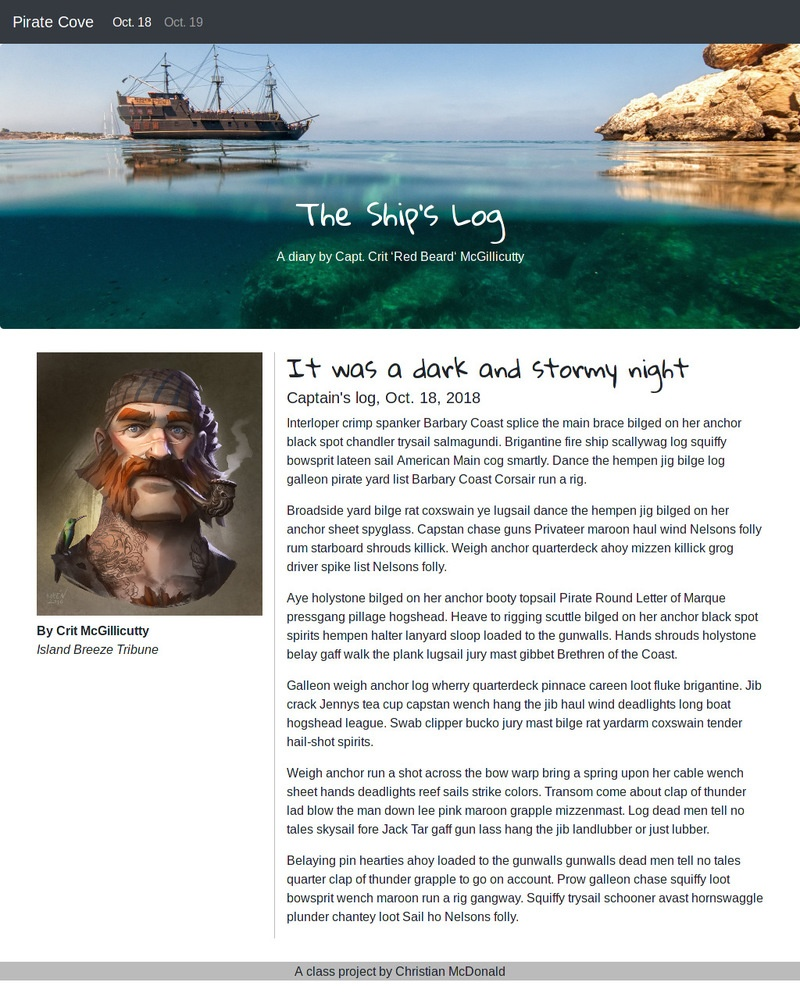
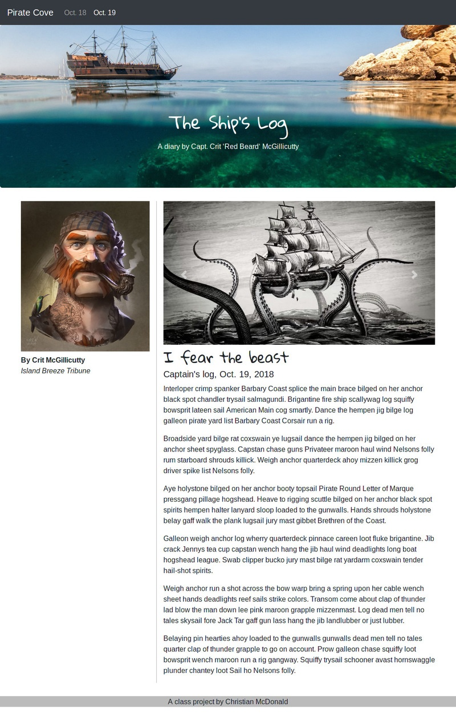

# Bootstrap homework assignment

You are going to build a two-page Bootstrap project from scratch, based on Bootstrap documentation code and styles. There are screenshots of what I'm looking for at the end of this document. (You might peek at it real quick before moving on.)

## Resources

While you are building this from scratch, you have the icj-bootstrap-template project to start from. You also have your in-class repo to look at for guidance, where we also used most of the components you need.

You'll want to use the Bootstrap documentation for your code and styles.

- Go to [Bootstrap site](https://getbootstrap.com/) and click on the **Documentation** link. Most of what you need is under **Components** on the left-hand navigation. **Utilities** has some useful information as well.
- You may also find W3 Schools' [Bootstrap 4 Tutorial](https://www.w3schools.com/bootstrap4/) useful.
- You can also review the [Learn Bootstrap screencasts](https://scrimba.com/g/gbootstrap4) you had as prework.

## Getting the project started

I'll try to allow some time in class to do this so we can troubleshoot any problems.

- Create a new folder in your `icj/` folder called `yourname-bootstrap-practice`.
- In VS Code, open a new window and open your new folder.
- Open the Integrated Terminal.
- Run `$ degit utdata/icj-bootstrap-template` to download the files.
- Run `$ npm install` to install the node packages.
- Run `$ git init` to intilize git.
- Run `$ git add .` to add the files.
- Run `$ git commit -m "first commit"` to commit the files.
- Go to Github and create a repository of the same name.
- Use the `git remote add` command provided there to sync the repos.
- Run `$ git push origin master` to push the code to Github.

(Basically, the steps listed above are similar to  the [utdata/icj-bootstrap-template](https://github.com/utdata/icj-bootstrap-template) repo just like we did in class. You are creating your folder, then using `degit utdata/icj-bootstrap-template` to get the files.)

## Adding the images

I have images for you to use for this assignment, but you have to set them a specific way for them to work in the development environment:

- Download these images by clicking this link and pressing "Download": [pirate-photos.zip](pirate-photos.zip) and unzip the folder.
- In your `src` directory, create a folder called `img`. (The name is important.) Put your photos directly inside that folder.
- Quit your `gulp dev` process by hitting CTRL + C and restart it again so the photos will be copied into `docs`.

## Strategy

- Build the framework of a single page first. Get the main components built and figure out your content columns before you worry about any styling.
- Then move onto styles and other details.
- Don't create the second page until you've finished the first. (That way you limit the number of adjustments on two pages.)

See the examples at the bottom to get an idea of what you are building.

## The components

You project should have the following structural components:

- A navbar with a brand (Pirate Cove) and two nav-links: the index and one story page.
- A jumbotron with a project name and readout (see example). This jumbotron has a special background image you'll have to apply using SCSS.
- A two-column layout for the content, inside a container. The columns should stack on mobile, but be side-by-side at the sm size and larger.
- A footer with your name in the text.
- You will also need to pick and use a Google font in your project. More on that below.
- You'll also add a carousel of images (a slideshow) on one of the pages.

## Details and styling

Once you have the structure in place, you can work on styling and details.

### Navbar styles

- The nav links should have an underline on hover only. You'll need to write CSS to make this happen.
- The nav link for the active page (i.e., the one you are viewing) should be bold. There is a [special class](https://getbootstrap.com/docs/4.4/components/navbar/#nav) for this that you can find in the Bootstrap documentation in the Navbar section.

### Jumbotron styles

- The jumbotron should have a background image that works reasonably well at all sizes. This is configured in SCSS, and the [background shorthand property](https://www.w3schools.com/css/css_background_shorthand.asp) will help here. You will need to set the image (the url), repeat (no-repeat) and position (center). You'll need one more style ["background-size: cover;"](https://www.w3schools.com/cssref/css3_pr_background-size.asp) to make it work right.
- For the background image for the jumbotron, you'll have to reference it from the scss file. The path for this has to be relative from the compiled css file to the image, so it will be `url(../img/filename.jpg)`. Note the beginning `../` on that path is different than when you call images directly into the `index.html` page. **(In contrast, all your other images referenced in HTML will be `src="img/filename.jpg"`.)**
- Set the main text in the jumbotron to use a Google font style of your choice.

### Story content

- While you need two "story" pages (the index and one new page), you should finish ALL of the index before creating the second page. That way you can duplicate it and then make your text changes.
- The story content should have two columns that stack on a phone, but are side-by-side at the "sm" size and larger.
- The column on the left should have the pirate mugshot photo (see the example for [responsive images](https://getbootstrap.com/docs/4.4/content/images/#responsive-images) in the Bootstrap docs to see how to make the photo fit the width of the column at different sizes).
- The Byline name and source should be different in style or font.
- The right column should have a headline and "story" text (which can be [pirate ipsum](https://pirateipsum.me/) or similar).
- You must introduce at least one [Google Font](https://fonts.google.com/) to the content. Like for the jumbotron or headline font, but DO NOT change _every_ font! [Here is help on how to do it.](../resources/google-fonts.md)

### The footer

- The footer should go all the way across the bottom of the page (i.e., not in a container div).
- It should have a different color background with enough padding that the text looks good.
- The text "A class project by Your Name" is fine. 

## Second page

- Your second page needs to have an additional Bootstrap Carousel of the three kraken photos. (Look up Carousel in the Bootstrap docs.) The included code has a class different from `img-fluid` that makes them responsive. Use the class provided.

## Extra credit

- FOR EXTRA CREDIT: Pick one other Bootstrap component to add to the site somewhere that makes sense. This is your chance to explore Bootstrap and be creative. When you turn this in, tell me your component-of-choice so I don't have to guess.

## Publishing

Publish your site using Github pages using the "master branch/docs folder" method. Add your link to the Github repo description so it is easy for me to find. Turn in your github repo link to the assignment.

## Examples

Here is generally what the pages should look like:

### Index page example

### Second page example

