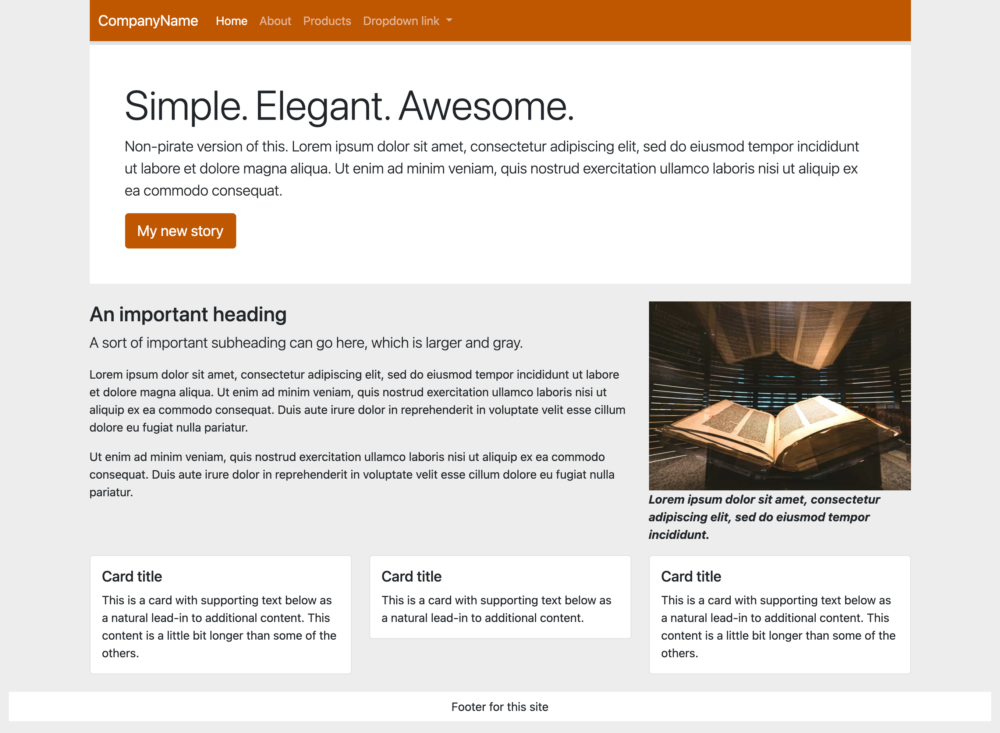
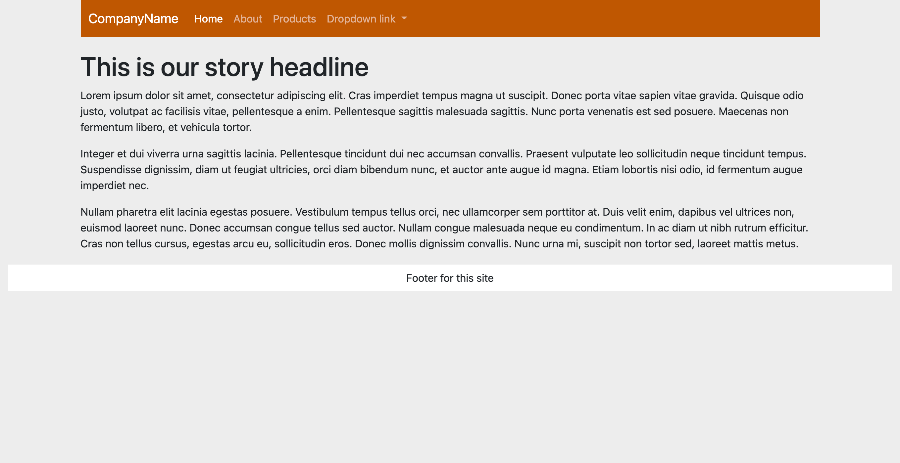
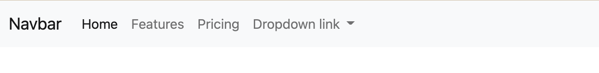
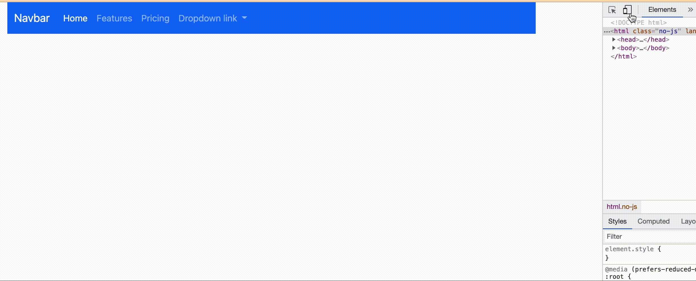
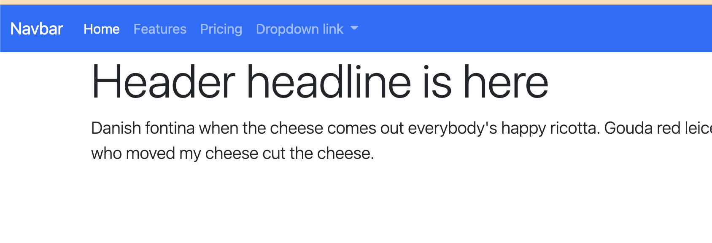
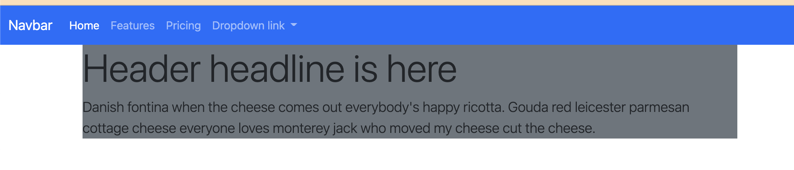

# Bootstrap Components

We're going to use Bootstrap **components** to build a _very generic_ two-page website. We'll also talk about different **content** and **utilities** classes.

Here is our goal:

An index page:



An article page:



We'll be pulling code from Bootstrap [documentation](https://getbootstrap.com/docs/5.1/getting-started/introduction/) and [examples](https://getbootstrap.com/docs/5.1/examples/) to build these pages. In some cases we aren't even updating the example text, we're just getting the components on our pages.

We'll start at the top of the page with a very common element to almost every website: Navigation.

## Navs and navbars

Navigation is separated into two parts in Bootstrap [Navs and tabs](https://getbootstrap.com/docs/5.1/components/navs-tabs/) and [Navbars](https://getbootstrap.com/docs/5.1/components/navbar/). Navs are the links, and navbars are the containers that can hold them.

To build a navigation bar for our site we'll poke around the Bootstrap documentation until we find something close to what we want and then copy that code and change it for our needs.

In our case we want the [Navbars](https://getbootstrap.com/docs/5.1/components/navbar/) documentation. We want something with dropdows just so you can see that code for later.

1. Go to the [Navbars](https://getbootstrap.com/docs/5.1/components/navbar/) docs.
1. Scroll through the examples until you find the one that has dropdown links but not a search bar. The text right before the code starts with "You can also use dropdowns in your navbar." It is right before the "Forms" section.
1. Use the **Copy** link to get the code.
1. Paste this code right after the opening `<body>` tag in our index.

This will add a nice navigation bar to our site:



### Adjust the navbar color

There are a bajillion ways to customize both navs (the links) and navbars (the container). We'll explore the docs just a bit more to change some colors and set up themeing for later.

1. Scroll a little further through the navbar docs and you'll get to a section about [color schemes](https://getbootstrap.com/docs/5.1/components/navbar/#color-schemes). Study how they work.
1. Update your navbar classes to use `navbar-dark` and `bg-primary` combo.
1. Save and check your page.

Your nav should turn blue with white type. Later we'll change the primary color to something different.

### Review how nav works on mobile

This navbar code includes some special classes and html that allows the menu items to collapse when viewed on small screens where they would knock into each other or wrap. We won't get into how it works (it's in the docs if you are interested) but I do want you to see and test it, especially the dropdown menus. Those dropdowns take JavaScript to work properly, so it is a good way to make sure Bootstrap is set up properly.

1. Use your DevTools Inspector or change your window width to mobile to see the menu button.
2. Click on it to make sure it works!



You should look over the other code within the navs, especially the list items classed as `nav-item` and the `a` tags within them classed as `nav-link`. These are your actual links. Where they have `href="#"` you'll update `#` to the path to your HTML pages.

I also want to point out here in the example the **Home** nav-link, which has two important classes because it represents the "Current" page on the site.

- The class `active` here makes that item bold in the navigation bar to give the reader a visual clue you that you are viewing that specific page from the navigation menu.
- The attribute `aria-current="page"` denotes to screen readers this is the active link and is important for those who can't "see" the visual clue that the `active` class gives us.

When building web sites, you should update page navigation to relfect both of those for each pages.

## A Jumbotron site header

Once upon a time (like 2021) Bootstrap had a special header component called a [Jumbotron](https://getbootstrap.com/docs/5.1/examples/jumbotron/). With Bootstrap 5's released in May 2021 they got rid of it because you can build a similar display with their existing utility classes, which allows us to introduce  Bootstrap examples along with content and utilites classes.

First let's take a look at what we are talking about.

1. Go to the [Bootstrap Examples](https://getbootstrap.com/docs/5.1/examples/) page. You can get this from any Bootstrap Docs page in the navigation item called **Examples**.

Now, these examples aren't quite as easy to use as the Component documentation. To see how they work you have to either download the examples (which gets you all of them) or view the source code of each page (In Chrome, View > Developer > View Source.)

Instead, we are just going to build this bit-by-bit.

1. After your nav, add a new `div` with a `class="container"`.
1. Inside that div, add another `div` with `id="header"`.
1. Inside the header div add an `h1` tag and a `p` tag and put some text in both. You can use [VS Code lorem](https://www.youtube.com/watch?v=txf-PS96NHo) or maybe try a little [cheese ipsum](http://www.cheeseipsum.co.uk/).

It should be something like this:

```html
<div class="container">
  <div id="header">
    <h1>Header headline is here</h1>
    <p>Danish fontina when the cheese comes out everybody's happy ricotta. Gouda red leicester parmesan cottage cheese everyone loves monterey jack who moved my cheese cut the cheese.</p>
  </div>
</div>
```

Let's talk about that **container**. In Bootstrap, a container div applies some margins and puts the content in the center of the browser. It's an important building block with responsive design because those margins expand/contract depending on your device width.

We will be putting more stuff inside that container div below the header, but that comes later.

The rest of that:

- We created a div with an id of `header` because will always be a unique item on the page. Giving it an id let's us target CSS styles to that part of the page if needed.
- The `h1` and `p` tags are standard. For now. We're about to gussy 'em up.

We will be giving a tour of Bootstrap content and utilites class as we go along.

### Typography classes

Let's take a gander at Bootstraps [Typography](https://getbootstrap.com/docs/5.1/content/typography/) documentation. These are a set of classes that can be applied to elements that give them a certain look. Because Bootstrap is customizable, it is possible to set these classes and then update them later with Sass. We're going to stick with default styles for now.

1. Look through the [Display headings](https://getbootstrap.com/docs/5.1/content/typography/#display-headings) section to see how to apply the `display-4` class and add that to your `h1` within your header.
2. Look at the [Lead](https://getbootstrap.com/docs/5.1/content/typography/#lead) section and then add that class to your `p` tag within the header.

At this point your index should be looking something like this:



### Backgrounds

[Backgrounds](https://getbootstrap.com/docs/5.1/utilities/background/) help us start out the tour of utilities documentation. We'll add some to our jumbotron.

1. Browser through the [Backgrounds](https://getbootstrap.com/docs/5.1/utilities/background/) docs so you can see how they are used.
1. On the header div, add the class attribute to make the background our "secondary" color (the default whis is a dark gray color).

```html
<div id="header" class="bg-secondary">
```

That should yield a result like this:



Still ugly, but we are getting there.

### Colors

Next on the tour are utility classes to control text colors.

1. Look through the [color](https://getbootstrap.com/docs/5.1/utilities/colors/) documentations and figure out how to make white text.
2. Add that class to the same div that you added the background color, so it look like this:

```html
<div id="header" class="bg-secondary text-white">
```

Still ugly, but you should have white text on the dark gray background.

### Spacing classes

Next we'll give our text some room to breathe using utility classes to control spacing between elements like margins and padding.

1. In a browser, go to the [Spacing](https://getbootstrap.com/docs/5.1/utilities/spacing/) documentation and look it over, especially the [notation](https://getbootstrap.com/docs/5.1/utilities/spacing/#notation) section.

Basically this shorthand to build space around items (margin) and inside items (padding). While I can't explain it better than they have, here is an abbreviated version:

- You use `m` margin or `p` for padding.
- Following _m_ or _p_ you add either: `t` (top), `b` (bottom), `l` (left), `r` (right), `x` (left and right), `y` (top and bottom), or nothing for all 4 sides.
- Then, you specify sizes with a hyphen and a value of `0` through `5` (5 being the largest amount of spacing).

We're going to build our header div to do this. Let's add the code first then I'll explain.

1. Add these classes to the header div. (If you do this one at a time you can see what each does):
    - `my-4` adds a margin to top and bottom of the div, basically moving it off the navigation.
    - `p-5` adds padding, the space "inside" the div between the border and the text.

### Borders

You set the color, width, style and radius of borders with various [border]() classes. Let's use those to add a slight radius to our header corners.

1. Review the [border-radius](https://getbootstrap.com/docs/5.1/utilities/borders/#border-radius) docs and add the class to your header div to make the corners of the box rounded. It's a pretty slight change.

### Button component

Here we'll dive back into the components section to get a [button](https://getbootstrap.com/docs/5.1/components/buttons/) to add to our Jumbotron-like header.

1. Go to [sizes](https://getbootstrap.com/docs/5.1/components/buttons/#sizes) part of the button docs to find the code for a **Large button**.
2. Add this code on a new line after the closing `p` tag in the header.

We'll edit this button later to make it go to a new page.

This might be a good time to use the git cycle to save and push your efforts to Github.

---

**Next**: We introduce the [Bootstrap grid]().