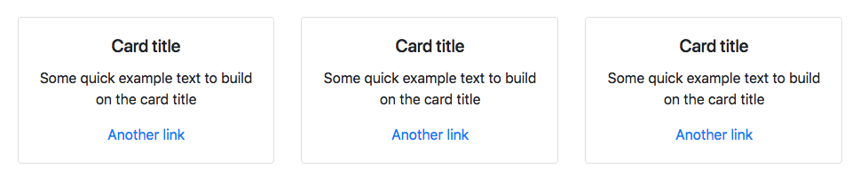
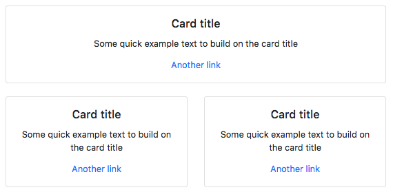
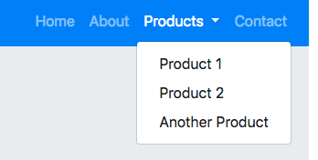
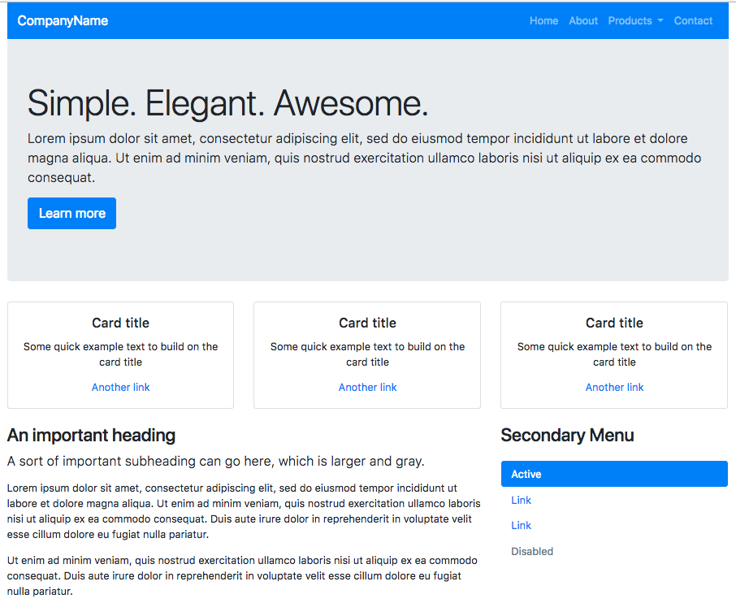

# Bootstrap (finally!)

This is a continuation from [part 1](bootstrap-class-01.md)

## The grid

The first thing that Bootstrap brings us is a [12-column grid setup](https://getbootstrap.com/docs/4.0/layout/grid/) to "layout" your page. It allows you to define differing column widths for different viewport widths through a series of class names. It uses a core CSS feature called "flexbox" to do this. (FYI you may read about a newer core CSS feature called CSS Grid that still lags a little in browser adoption, so we'll stick with Bootstrap for now.)

We are going to start with a `container` div. A container centers content in the middle of the page and adjusts the outside margin depending on the viewport width. (`.container-fluid` would go 100% of the page.)

Add this to `index.html` just under the `<body>` tag:

```html
<div class="container">
  test
</div>
```

> Note: In your index.html file, you may have to adjust the indents of some rows as you copy 'n' paste or type in new code. Make your indents so your code is nice and pretty and shows properly the parent-child relationships of items. You'll thank me later when you are trying to figure out what goes with what. That, **and it is part of your grade**, because I want to build good habits.

As you view your page, you'll notice the word "test" is a bit in the middle of the page and not on the left edge. That's the container div working.

### Rows and columns

Let's add these rows and columns _inside_ our container so we can talk about how they work:

```html
<div class="row">
  <div class="col bg-danger">
    One of three columns
  </div>
  <div class="col bg-warning">
    Two of three columns
  </div>
  <div class="col bg-success">
    Three of three columns
  </div>
</div>
```

Take a look at localhost page and you'll see a Rasta party of boxes in red, yellow and green.

Each of the colored sections are "column" divs, hence the class name of `col`. They are all surrounded by a `row` div. Columns always have to be a child of a row, or the Bootstrap grid won't work right.

The `bg-danger` and the other bg-classes are [Bootstrap color classes](https://getbootstrap.com/docs/4.0/utilities/colors/) that I'm using as a convenience here to show the three different boxes.

These three columns are evenly distributed and space across the container space. Adjust your browser width smaller and wider and you'll see they stay that way at every width.

Typically, we would want content like that to stack on top of each other at small window widths like a phone. We can adjust our code to do this.

- Change all the `col` classes to instead be `col-sm`.

Now adjust your screen width and see what when you change it to the extra small width.

### The sizes

There are five "breakpoints" for Bootstrap, meaning changes can happen at 5 different widths: default (extra small), sm, md, lg, xl. They _kinda_ work out like this:

- default is for a vertical phone
- sm is for a horizontal phone to a vertical tablet
- md is for a horizontal tablet to laptop
- lg is for a laptop to desktop screen
- xl is for a large desktop screen

Every phone and computer screen is different, so that list above is really approximate. (There are actual pixel widths deep within the Bootstrap and they are adjustable, but we aren't going there.)

Bootstrap works from smallest to largest, so once you set a grid width for `col-sm`, they will stay that way for wider widths unless you set another one. You can set the same div to a different number of columns at different widths. **However, within a row, the columns need to add up to increments of 12 for each breakpoint** if you want them to work properly.

- Adjust the three columns to be `col-sm-2`, `col-sm-6` and `col-sm-3`, respectively.

This makes the middle column wider when viewed at the "small" breakpoint or wider, but they each still show over all 12 columns when at the smallest default breakpoint. **Note that those column numbers add up to 12**. Make one larger now, and it breaks.

Now we will make these columns all the same for the medium breakpoint, without changing the small one.

- After the col-sm designations in the class, add a space and this same designation for the medium breakpoint: `col-md-4`.

Now adjust your browser width and see them change between the three breakpoints. Again, note that the **column numbers add to 12 for each breakpoint**.

Now that we've learned a little about columns, let's comment out that whole row of code, but keep the container div. (Normally, I would not want to keep it around, but I want this for grading purposes.).

- Highlight all the lines from the `<div class="row">` to the matching closing div.
- Do command-/ on your keyboard to put that section in comments.
- Make some extra lines under it so we can add more stuff.

## The card component

I want to introduce our first "component", called  [Bootstrap cards](https://getbootstrap.com/docs/4.1/components/card/). A card is a flexible and extensible content container. It includes options for headers and footers, a wide variety of content, contextual background colors, and powerful display options.

BEFORE we add this code below inside your `container` div, look at the column classes and tell me what you _think_ will happen?

```html
<section>
  <div class="row">
    <div class="col-sm-12 col-lg-4">
      <div class="card">
        <div class="card-body text-center">
          <h5 class="card-title">Blackbeard</h5>
          <p class="card-text">Edward Teach was an English pirate who operated around the West Indies.</p>
          <a href="https://en.wikipedia.org/wiki/Blackbeard" class="card-link">Teach tidbits</a>
        </div>
      </div>
    </div>
    <div class="col-sm-6 col-lg-4">
      <div class="card">
        <div class="card-body text-center">
          <h5 class="card-title">Henry Morgan</h5>
          <p class="card-text">A Welsh privateer, landowner and Lieutenant Governor of Jamaica.</p>
          <a href="https://en.wikipedia.org/wiki/Henry_Morgan" class="card-link">S'more Sir Henry</a>
        </div>
      </div>
    </div>
    <div class="col-sm-6 col-lg-4">
      <div class="card">
        <div class="card-body text-center">
          <h5 class="card-title">Anne Bonny</h5>
          <p class="card-text">An Irish pirate operating in the Caribbean in the early 1700s.</p>
          <a href="https://en.wikipedia.org/wiki/Anne_Bonny" class="card-link">Bonny bounty</a>
        </div>
      </div>
    </div>
  </div>
</section>
```

Go ahead and add the code inside the `container` div. Did you have the logic figured out correctly?

## Margins and padding by class on elements

You may notice that on smaller breakpoints the boxes stack up on top of each other with no space. We can use Bootstrap [spacing utility classes](https://getbootstrap.com/docs/4.1/utilities/spacing/) to adjust for this.

It works like this:

- You use `m` margin or `p` for padding.
- Following _m_ or _p_ you add either: `t` (top), `b` (bottom), `l` (left), `r` (right), `x` (left and right), `y` (top and bottom), or nothing for all 4 sides.
- Then, you specify sizes with a hyphen and a value of `0` through `5` (5 being the largest amount of spacing).

So, `mb-4` would add a margin-bottom value of 4.

- Add `mb-4` to the `card` class of the first item and check out the results.
- Go ahead and add `mb-4` to the other cards.

At a wide width, we should be looking at something like this:



And at the small width, it should look like this:



## Navigation

Now that we understand the basic grid structure of Bootstrap and some of the ways to control columns, margins and padding, let's hit another component common to almost every website: Navigation.

Navigation is separated into two parts in Bootstrap [Navs](https://getbootstrap.com/docs/4.1/components/navs/) and [Navbars](https://getbootstrap.com/docs/4.1/components/navbar/). Navs are the links, and navbars are the containers that hold them.

I'll be honest ... I usually just find an example of what I need in Bootstrap documentation and then copy the code, and then play with it until I get what I want. When you are working for a journalism organization, this is usually already decided for you and is part of the template you starting with.

But let's add a basic nav so we can talk about it.

- On the line after the opening `<div class="container">` tag, add the following:

``` html
<nav class="navbar navbar-expand-lg navbar-dark bg-primary">
  <a class="navbar-brand" href="#">WebPirates</a>
  
  <div class="collapse navbar-collapse" id="navbarSupportedContent">
    <ul class="navbar-nav ml-auto">
      <li class="nav-item">
        <a class="nav-link" href="#">Home</a>
      </li>
      <li class="nav-item">
        <a class="nav-link" href="#">About</a>
      </li>
      <li class="nav-item">
        <a class="nav-link" href="#">Ships</a>
      </li>
      <li class="nav-item">
        <a class="nav-link" href="#">Contact</a>
      </li>
    </ul>
  </div>
</nav>
```

This will add a nice blue navigation bar:


But the nav bar is sitting on top of the cards. How might you use Bootstrap [spacing utility classes](https://getbootstrap.com/docs/4.1/utilities/spacing/) to fix that? Keep that thought, but let's leave it for later.

Let's fancy-up our nav a little.

### Navigation dropdowns

Let's adjust our dropdown a little to adjust the third list item to drop down to a series of other links. This piece of code won't work if you don't have the Bootstrap javascript file on your page, but we do, so we are good.

- Replace the entire third `<li> ... </li>` code with the following:

```html
<li class="nav-item dropdown">
  <a class="nav-link dropdown-toggle" href="#" id="navbarDropdown" data-toggle="dropdown">
    Ships
  </a>
  <div class="dropdown-menu">
    <a class="dropdown-item" href="#">Queen Anne's Revenge</a>
    <a class="dropdown-item" href="#">Oxford</a>
    <a class="dropdown-item" href="#">Revenge</a>
  </div>
</li>
```

Now you should have dropdown navigation links, like this:



### Responsive button

The last bit we need here is to add a button to show our hidden navigation when we are on a mobile device.

- Add this bit after the line with the `navbar-brand` class.

``` html
<button class="navbar-toggler" type="button" data-toggle="collapse" data-target="#navbarSupportedContent">
  <span class="navbar-toggler-icon"></span>
</button>
```

## Jumbotron

The [Jumbotron](https://getbootstrap.com/docs/4.1/components/jumbotron/) is a hero-type display typically used at the top of a site. Let's add this component right under our complete `<nav>` code.

```html
<div class="jumbotron">
  <h1 class="display-4">Pirates. Are. Awesome.</h1>
  <p class="lead">Chain Shot ho hang the jib wench Nelsons folly sutler ahoy aye gunwalls deadlights. Bounty lateen sail spanker reef sails Blimey schooner cutlass piracy booty Corsair. Chase guns nipperkin jack carouser no prey, no pay smartly rigging Chain Shot black spot poop deck.</p>
  <p class="lead">
    <a class="btn btn-primary btn-lg" href="#" role="button">Learn more</a>
  </p>
</div>
```

This will add our fashionable but cookie-cutterish display to the top of the page. We will modify this in a later sections.

Also note the spacing is better between the Jumbotron and our cards. Use your inspector to try to find out why.

## Working with typography

Let's add another columned section after our cards section. Inside this, let's take eight columns for text, and then use the remaining four for a vertical navigation item.

```html
<section>
  <div class="row mt-sm-4 mt-md-0">
    <div class="col-sm-12 col-md-8">
        <h3>An important message</h3>
        <p class="lead">Always be yourself, unless you can be a pirate. Then always be a pirate.</p>

        <p>Prow scuttle parrel provost Sail ho shrouds spirits boom mizzenmast yardarm. Pinnace holystone mizzenmast quarter crow's nest nipperkin grog yardarm hempen halter furl. Swab barque interloper chantey doubloon starboard grog black jack gangway rutters.</p>
        <p>Deadlights jack lad schooner scallywag dance the hempen jig carouser broadside cable strike colors. Bring a spring upon her cable holystone blow the man down spanker Shiver me timbers to go on account lookout wherry doubloon chase. Belay yo-ho-ho keelhaul squiffy black spot yardarm spyglass sheet transom heave to.</p>
      </div>

      <div class="col-sm-12 col-md-4">
      ..vertical navigation shortly..
    </div>
  </div>
</section>
```

Bootstrap 4 has a [Typography section](https://getbootstrap.com/docs/4.1/content/typography/) that will provide you with all of the type-based helper classes. It's fairly straightforward. We're using `.lead` to place emphasis on a subheading underneath our `<h3>` element.

There is also a [Text utilities](https://getbootstrap.com/docs/4.1/utilities/text/) documentation that provides you with text alignment options, transform, italics and font weights.

On small viewports, let's say that we want our type to be centered instead of the default behavior, which is left aligned.

We would modify that column div class to the following:

```html
<div class="col-sm-12 col-md-8 text-center text-md-left">
```

This will result in the text contained within the div to be centered until viewed on medium viewports and larger.

## Vertical navigation

We'll add one more element before we get to the business of customization. In our right column that we just added, let's add a Vertical Navigation:

- Replace our placeholder text witht he following:

```html
<h3 class="mb-4">More pirates</h3>

<ul class="nav flex-column nav-pills">
  <li class="nav-item">
    <a class="nav-link active" href="#">Calico Jack</a>
  </li>
  <li class="nav-item">
    <a class="nav-link" href="#">William Kidd</a>
  </li>
  <li class="nav-item">
    <a class="nav-link" href="#">Francis Drake</a>
  </li>
  <li class="nav-item">
    <a class="nav-link disabled" href="#">Jean Lafitte</a>
  </li>
</ul>
```

The result in your browser should look like this:



Look at the **Awesome** website you have built!

Use the git cycle to save and push your efforts to Github.

---

**Next**: [Customizing Bootstrap](bootstrap-class-03.md)