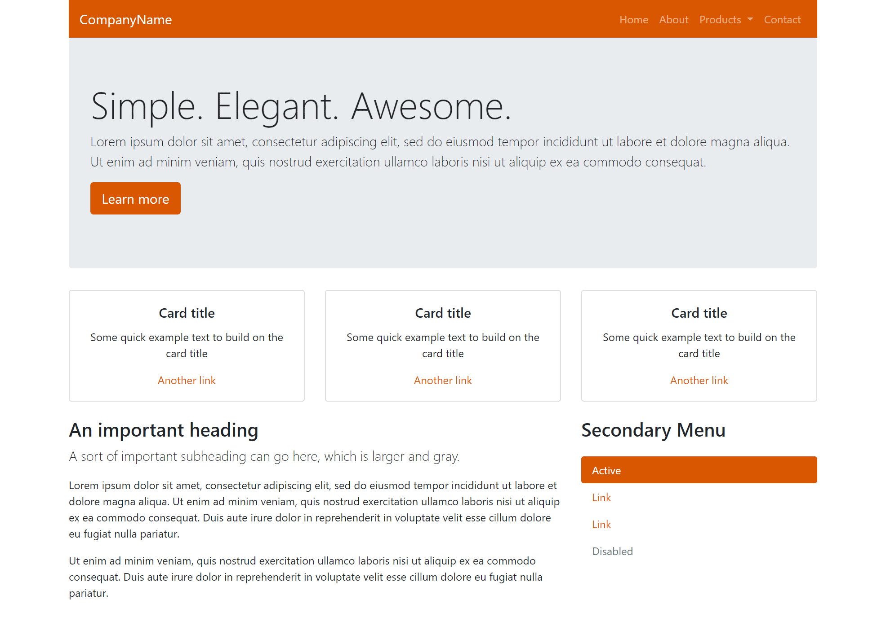
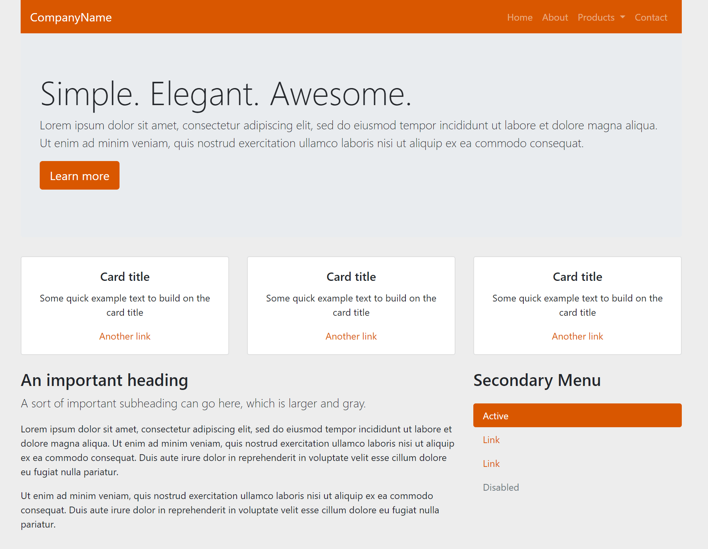
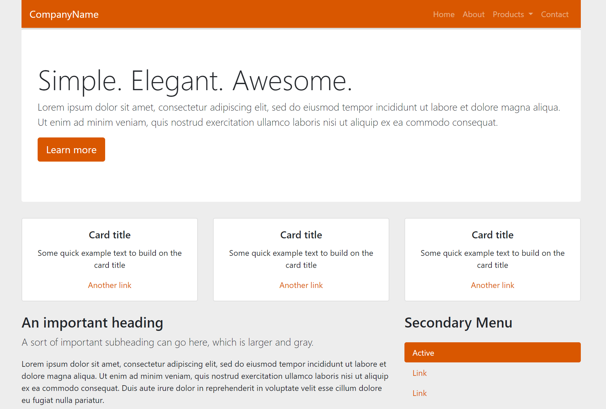

# Modifying Bootstrap

**Note**: This is a continuation of [part 1](bootstrap-class-01.md) and [part 2](bootstrap-class-02.md) of this lesson.

We now have us a pretty nice website, and we could imagine this being the entry page to a pretty nice journalism package. But, it looks a bit cookie-cutterish.

Fortunately, Bootstrap 4 has a robust system that enables customizing common elements quite easy.

- Open up the `/src/scss/styles.scss` filw and paste the following:

```scss
// Variable Overrides

// Bootstrap Sass Imports
@import "node_modules/bootstrap/scss/bootstrap";
```

According to the [Theming section](https://getbootstrap.com/docs/4.1/getting-started/theming/), you can choose to either include **all** of the Bootstrap 4 sass files, or you could include individual items based on your needs. To keep things simple, we'll just import everything as we have above. (The advantage to picking and choosing which Sass files is you have smaller published CSS and JavaScript files when you are done.)

> **Note**: One that may happen as we are editing our `styles.scss` file during these exercises: If you incorrectly type one of the styles, it may stop your _gulp_ command with an error. If this happens, read the error to discover where the problem is, try to fix it and run `gulp` in your terminal again. It may help to run `gulp` in your Integrated Terminal so you can see when this happens.

## Theme colors

Perhaps the most common theming need is to change the colors.

If you open up the `node_modules/bootstrap/scss/_variables`.scss file, you will notice at the top it mentions Color system. In this section, you will see all of the variables that you're able to overwrite that to pertain to colors.

Let's change just the primary color:

- Modify the `src/styles.scss` to the following:

```scss
// Variable Overrides 
$theme-colors: (
  "primary": #d95700
);
```

Save it and viola! We have Longhorn-ified our website.



If you are wondering how I knew what color to use for Longhorn Burnt Orange, [I looked it up](https://brand.utexas.edu/identity/color/).

Now let's change the background color.

- Add this as to your `styles.scss` file under the them color declaration:

```scss
$body-bg: #ededed;
```

Now the result looks like this:



Hmm, now, our jumbotron (hero) section looks ugly, as it was also gray.  

We can make custom adjustments to specific elements by using the inspector in chrome or firefox, finding the associated classes of the elements we want to change, and changing those in our styles.scss file.

In this case, the class responsible for the jumbotron is .jumbotron. Let's change the background color and add a slight border to the top of it, to simulate a drop shadow from the navbar. In this case we are using plain CSS declarations to make these style changes, because Sass understands those as well.

- Add this under the bg-color declaration:

```scss
.jumbotron {
    background-color: #ffffff !important;
    border-top: 3px solid rgb(219, 219, 219);
}
```

Now we are all fixed up:



OK, we've now hit the basics of Bootstrap and how we can modify the default colors and such using Sass and SCSS.

Make sure to use your git cycle to save your code and push it to your master branch.

---

**Next**: We'll [download and run](bootstrap-class-04.md) one of your college's repo.