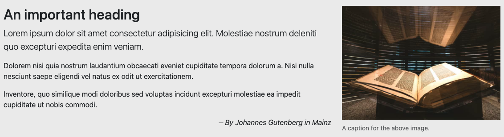

# Introducing Grids

> This is a continuation of the Bootstrap tuorial.

## The grid

One of the main features that Bootstrap brings us is a [Grid system](https://getbootstrap.com/docs/5.1/layout/grid/) to build "layouts" for your pages. The grid allows you to define column widths for different viewport widths through a series of class names. It uses a core CSS feature called "flexbox" to do this.

1. Go to the [Grid system](https://getbootstrap.com/docs/5.1/layout/grid/) documentation and look through it.
2. Come back to the first [example](https://getbootstrap.com/docs/5.1/layout/grid/#example) and copy the code and add it into your page after the closing of your header container.
3. Save your page and you should see the three columns in your project.

We're going to enhance this a bit by adding some background colors to each column so we can see each of the more easily.

1. Add a different background color class after `col` for each column. I suggest these for a Rasta party of red, yellow and green: `bg-danger`, `bg-warning` and `bg-success`.

Your code should look like this:

```html
<div class="container">
  <div class="row">
    <div class="col bg-danger">
      Column
    </div>
    <div class="col bg-warning">
      Column
    </div>
    <div class="col bg-success">
      Column
    </div>
  </div>
</div>
```

And your page should look like this at this point:


## The responsive grid

These three columns are evenly distributed across the container space. Adjust your browser width smaller and wider (or use the DevTools Inspect) and you'll see they stay that way at every width.

Our goal here is to be able to adjust how wide those columns are at different browser widths. We do this so we can control how the content displays on different devices like phones, tablets and computers.

### The sizes

There are five "breakpoints" for Bootstrap, meaning changes can happen at 5 different widths: default (extra small), sm, md, lg, xl and xxl. They _kinda_ work out like this:

- the default `col` is for a vertical phone
- `sm` is for a horizontal phone to a vertical tablet
- `md` is for a horizontal tablet to laptop
- `lg` is for a laptop to desktop screen
- `xl` is for a large desktop screen
- `xxl` is for an even wider desktop screens

Every phone and computer screen is different, so that list above is approximate. (There are actual pixel widths set deep within the Bootstrap code and they are adjustable, but we aren't going there.)

Looking back at our three columns, we would want content like that to stack on top of each other at extra small browser widths, like on a phone. We can adjust our code to do this.

1. Change all the `col` classes to instead be `col-sm`.
1. Adjust your browser width and watch how the columns change.

Now that you've added a "small" `sm` breakpoint, the divs stack on top of each other at the default "extra small" breakpoint, as they are supposed to, but then display evenly across at small or greater widths.

Bootstrap works from smallest to largest, so once you set a grid width for `col-sm`, they will stay that way for wider widths unless you set another one. You can set the same div to a different number of columns at different widths. **However, within a row, the columns need to add up to increments of 12 for each breakpoint** if you want them to work properly.

1. Adjust the three columns to be `col-sm-3`, `col-sm-6` and `col-sm-3`, respectively.

This makes the middle column wider when viewed at the "small" breakpoint or wider, but they each still show over all 12 columns when at the extra-small default breakpoint. **Note that those column numbers add up to 12**. If the total is greater than 12, it breaks into a new column.

Now we will make these columns all the same width for the medium breakpoint, without changing the small breakpoint.

1. After the col-sm designations in the class, add a space and then this designation for the medium breakpoint: `col-md-4`. Do this for all three columns.

Now adjust your browser width and see them change between the three breakpoints. Again, note that the **column numbers for each size add to a factor of 12 for each breakpoint**. i.e, the `sm` numbers total to 12, and then the `md` numbers total to 12.

As a bit of a check, this part of our code should look like:

```html
<div class="container">
  <div class="row">
    <div class="bg-danger col-sm-3 col-md-4">
      Column
    </div>
    <div class="bg-warning col-sm-6 col-md-4">
      Column
    </div>
    <div class="bg-success col-sm-3 col-md-4">
      Column
    </div>
  </div>
</div>
```

This is how your page should behave at the default `xs`, the `sm` and `md` breakpoints:

### xs

Columns are stacked.


### sm

Middle column is wider.


### md

Columns are even.


Now that we've learned a little about columns, we'll tear this apart and build something useful.

## Using our grid system

Now we'll work on the part of our site that will look like this:



We'll reuse the first two columns of our exercise code to make this.

1. On the container div, also add a class called `highlight`. (We'll build on the `highlight` class later.)
1. Delete one of the three column divs.
1. Remove the column class names (but leave the tag, because we will replace them.)

Your code should look like this:

```html
<div class="container highlight">
  <div class="row">
    <div class="">
      Column
    </div>
    <div class="">
      Column
    </div>
  </div>
</div>
```

### Add your content

1. Replace the word "Column" in the first column with an `h2` headline tag and a few `p` tags with some lorem ipsum text.
1. Next we need a photo to use in our project. You can use your own jpeg photo or you can download this one of the [Gutenberg Bible at the Harry Ransom Center](../images/gutenberg.jpeg).
1. Put your photo inside your `src/img` folder.
1. Stop the gulp dev watch process (Cntl+C in your Terminal window) and then retart it using `gulp dev`. This will process the photo and make it available in the docs `img` folder. It's an important step as photos are only processed when `gulp dev` starts up.
1. Replace the word "Column" in the second column with an `` tag that pulls in your photo.
1. After the `` tag, add a `<p>` and some text that will become your photo caption.

### Apply md column sizes

For this display we want to stack the columns (text above photo) for both the default xs and the sm sizes. This means our first column change will be at the medium `md` size. We want them both to take up half with space at six columns.

1. Add `col-md-6` to both of the columns.
1. Save and view the result.

When you look at the result, the first column with the headline and text will be fine, but the column with the photo will be too wide because the photo is bigger than the column. We can fix that.

### Responsive images

There is a magical "responsive image" class in Bootstrap `img-fluid` that changes the width of a photo to be the width of the item that holds it. By setting this, the photo will grow and shrink to fit the column.

1. Add a class to your image tag and set it to `class="img-fluid"`.

This will shrink the photo to fit within the second column, set at 6 cols.

This part should look like this now:


### Add large size

As the page gets a little wider, we want give the text a little more space than the photo.

1. Add `lg` sizes to your two columns. Set the first one at 8 columns and the second one at 4 columns.
2. Save and check the results. You should see your columns change at the medium and large widths.

We've finished building this part of the pages for now. Next we'll add the cards to our page.

---

**Next**: [Bootstrap cards](bootstrap-class-04.md)
