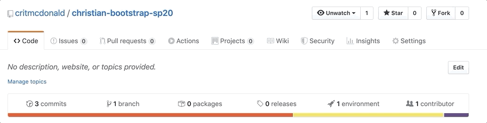

# Publishing to Github

Github has a way that we can publish static web pages to the web, for free, using [Github Pages](https://pages.github.com/). While it is not intended for commercial use, it is sufficient and appropriate for our class. There is a _soft_ 100GB limit per month. If you exceed that, you'll get a polite email from Github suggesting better ways to handle your traffic. Consider that a lovely problem to have because 100GB is quite a lot.

There are [Github tutorials](https://help.github.com/articles/configuring-a-publishing-source-for-github-pages/) on setting up Github pages. We'll go through one of the many methods here.

## Publishing through the /docs/ folder

You might have thought it strange that we were putting all our publishable code inside a `/docs` folder, but this is why. We can set that as our "publish" directory in Github pages, separate from our other development source code.

- Go to your Github repo for this project and select **Settings**.
- Go down the page there until you find **Github Pages**.
- Where is has the dropdown for **Source**, choose the **master branch/docs folder** option.

After a few minutes, your website will be available on the web at a url based on your username and project repo name:

`https://{githubusername}.github.io/{project-name}/`

Please take that URL and add it to your Github repo like this:

## More Github pages

There are other ways to publish [Github Pages](https://help.github.com/articles/configuring-a-publishing-source-for-github-pages/), depending on your needs.

---

**Next**: We'll [download and run](bootstrap-class-05.md) a fellow student's project.