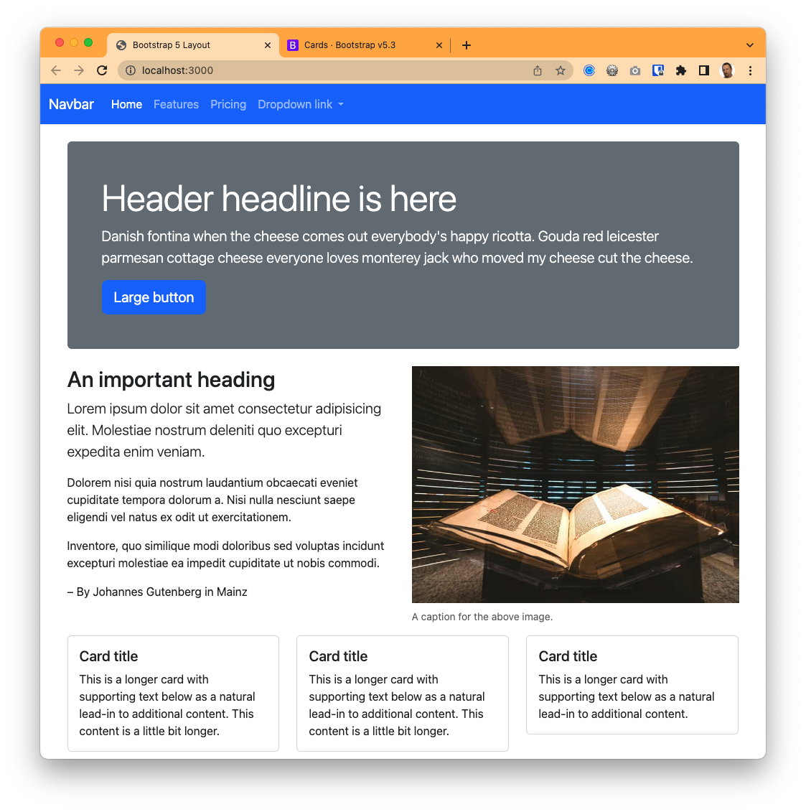

# The card component

> This is a continuation of the Bootstrap tutorial.

Here we will introduce [Bootstrap cards](https://getbootstrap.com/docs/5.1/components/card/), a content component that has a ton of options to display a wide variety of content.

Our goal here is to build this part of our page:

## The ever-versatile card

1. Scan through the [Bootstrap cards](https://getbootstrap.com/docs/5.1/components/card/) documentation
and note all the different types of cards you can make. Compare the different styles and note which classes are used.

> IMPORTANT: In a lot of these examples you'll see `style="width: 18rem;"`. Bootstrap uses it here so the card doesn't stretch across the column in their examples. **Most of the time you don't want this style and should delete it.** We'll use other ways to control width.

1. In your index page after the `highlight` container div, add a new container div.
1. In the docs, find the [Grid cards](https://getbootstrap.com/docs/5.1/components/card/#grid-cards) example. Copy the first grid example there and put that inside your container div.
1. Save and look at it. Because we are pulling from the template and there are parts we don't need, we need to make some edits.
    - Delete one of the four cards so there are only three. You should be able to figure out where they start and end by looking at the patterns in the code.
    - Remove the `` line in each of the cards since we don't need the photo.

## Adjusting grid cards

With this setup, each card is inside a Bootstrap column. We can use a special [Row columns](https://getbootstrap.com/docs/5.1/layout/grid/#row-columns) class to set how many columns (and therefore how many cards) should show in a row before the columns/cards wrap into a new row.

The `row-cols` setting in the template says to display 1 card per row `row-cols-1` until the medium width, which is changes to 2 cols per row with `row-cols-md-2`. The last style there `g-4` sets the gutter width between the columns.

1. Edit the row div to change the `md` row setting to "3" instead of "2".
1. Save and look how the page changes.
1. Add one more class: `my-4`. This utility class adds a margin at the top and bottom of the row.

With this method, you can have any number of cards but you can set how many cards/columns you want at each width. It is very useful.

This is how your page should look now:

Next we'll explore some customizations.

---

**Next:** [Customizing Bootstrap](bootstrap-class-05.md)
