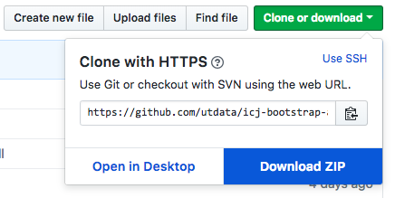

# Downloading and running an npm project

## Goals

- Download a fellow student's repo to our local machine, treating it as a new project template.
- Run `npm install` to install all the software needed to work on the project.
- Run `gulp` to set up our development environment.

## A little background

When we started this project, we created a series of folders and then installed a bunch of npm packages. As we did so, we created a file called `package.json` (and `package-lock.json`). It looks something like this:

```js
{
  "name": "bootstrap-yourname",
  "version": "1.0.0",
  "description": "",
  "main": "index.js",
  "scripts": {
    "test": "echo \"Error: no test specified\" && exit 1"
  },
  "keywords": [],
  "author": "",
  "license": "ISC",
  "devDependencies": {
    "browser-sync": "^2.24.7",
    "gulp": "^3.9.1",
    "gulp-sass": "^4.0.1"
  },
  "dependencies": {
    "bootstrap": "^4.1.3",
    "jquery": "^3.3.1",
    "popper.js": "^1.14.4"
  }
}
```

The syntax of the file is called JSON, which is the preferred datatype for Javascript. It is the lines `devDependencies` and `dependencies` that will tell npm what to install.

When we used the npm install processes on our own projects it also created the `node_modules` folder, which contains all the software you used, like `gulp` and `gulp-sass`, etc. However, you'll recall we also created a `.gitignore` file to exclude those files because there are thousands of them and they don't need to be saved in our repo (which you'll see in a moment).

FWIW, this is the line in the `.gitignore` file that excludes our `node_modules` folder.

```bash
# Dependency directories
node_modules/
```

It is the `package.json` file that is the secret sauce. It was our use of the flags `--save` and `--save-dev` during installation that added our packages to that list.

This file allows another developer to download your repo and then run `npm install` to install all the npn packages into their own `node_modules` folder and then run all your code. (If you or another developer forgets the `--save` and `--save-dev` flags during the install, then the software won't work for the next developer that comes along.)

This is what we'll test using your partner's repo.

## Download the repo

- Pick a partner in class and go to their Github page.
- Click on Repositories to list all their repos.
- Click on the link to their `bootstrap-myname` repo.
- Click on the **Clone or download** button and then click on **Download ZIP**.



This will download all of their files into your Downloads folder.

- Find and open your Downloads folder.
- If the file was not un-zipped automatically on download, double-click on it to extract their actual folder. (This may work a little differently on Windows machines).
- Now move (you can drag 'n' drop) that entire folder into your `Documents/code` folder.

## Open the folder in VS Code

- Close all your other VS Code windows so you don't get confused. (But don't quit the VS Code app.)
- Go under **File** to **New Window**
- On the Welcome screen under **Start** you'll see a link for **Open Folder**. Click on that link.
- Negotiate to your `Documents/code/bootstrap-yourpartner` folder (but _not_ inside of it!) and click the **Open** button.

This should open your partner's project in VS Code and you should see all their files in the Explorer.

## Run npn install

- Open your Integrated Terminal and run this:

```bash
npm install
```

You should see a bunch of stuff happen ... a `node_modules` folder will be created and a bunch of stuff will be downloaded into it.

## Launch the project

Now you just have to run the default gulp task to get the project running.

```bash
gulp
```

This should generate all the CSS and JavaScript files needed and launch a browser with your partners project.

## We did not clone!

In this case, we did not use `git clone` on the file when we downloaded it, so these files are not connected to your partner's Github file. That was planned, as this is one way that developers save template projects that you don't want overwritten with new changes.

---

We are done with this lesson!