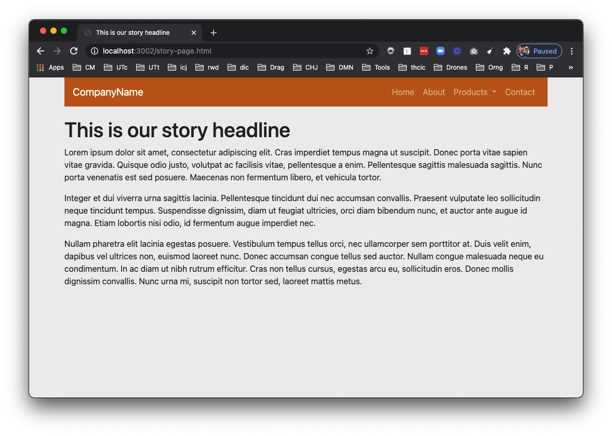

# Index vs other pages

OK, you have a Bootstrap website published now. It is only one page, but it is a special one. We named this page `index.html` for a reason because that is one of the default page names that browsers look for when they read a website directory.

When you run `gulp dev` on your local machine, the development server takes all the HTML files it finds in `src/html` and processes them as complete pages in our `docs/` folder. When `gulp dev` launches your browser it sets that `docs/` folder as the "root" of our server and then publishes it at our dev url, something like `http://localhost:3002/` (Your number at the end may differ). The browser at that point is looking at the files inside the `docs/` folder for a default page to load, finding `index.html`.

A similar thing happens when you use Github Pages. We used the Github Pages settings to set our site to load from that same `docs/` folder, so when it publishes my version of this site -- `https://utdata.github.io/icj-bootstrap-answers/` -- you'll notice there is nothing after the last `/` of that URL. When a web server is given that URL it looks inside the `docs/` folder of the repo and finds `index.html`.

Website home pages like this act as gateways to the rest of our site. So far we've built the gate, but there is nothing behind it. Let's change that.

## Adding a new page

Let's add a new page to our website.

- Add a new file inside `src/html` called `story-page.html`.
- Inside of that page, add all of the code below.
- If you are not already running your browsersync process, you'll need to run `gulp dev` again so the new page will get processed.

```html
<!DOCTYPE html>
<html class="no-js" lang="en">
  <head>
    <title>Learn about ye Pirates, matey!</title>
    <meta http-equiv="x-ua-compatible" content="ie=edge">
    <meta name="viewport" content="width=device-width, initial-scale=1.0" />
    <link rel="stylesheet" href="css/bootstrap.css">
    <link rel="stylesheet" href="css/styles.css">
  </head>

<body>
  <!-- Content starts here -->
  <div class="container">
    <nav class="navbar navbar-expand-lg navbar-dark bg-primary">
      <a class="navbar-brand" href="index.html">WebPirates</a>
      <button class="navbar-toggler" type="button" data-toggle="collapse" data-target="#navbarSupportedContent">
        <span class="navbar-toggler-icon"></span>
      </button>
      <div class="collapse navbar-collapse" id="navbarSupportedContent">
        <ul class="navbar-nav ml-auto">
          <li class="nav-item">
            <a class="nav-link" href="#">Home</a>
          </li>
          <li class="nav-item">
            <a class="nav-link" href="#">About</a>
          </li>
          <li class="nav-item dropdown">
            <a class="nav-link dropdown-toggle" href="#" id="navbarDropdown" data-toggle="dropdown">
              Ships
            </a>
            <div class="dropdown-menu">
              <a class="dropdown-item" href="#">Ranger</a>
              <a class="dropdown-item" href="#">Queen Anne's Revenge</a>
              <a class="dropdown-item" href="#">William</a>
            </div>
          </li>
        <li class="nav-item">
            <a class="nav-link" href="#">Contact</a>
          </li>
        </ul>
      </div>
    </nav>

    <article>
      <h1>Learn about ye Pirates, matey!</h1>
      <p>Row scuttle parrel provost Sail ho shrouds spirits boom mizzenmast yardarm. Pinnace holystone mizzenmast quarter crow's nest nipperkin grog yardarm hempen halter furl. </p>
      <p>Swab barque interloper chantey doubloon starboard grog black jack gangway rutters. Deadlights jack lad schooner scallywag dance the hempen jig carouser broadside cable strike colors.</p>
      <p>Bring a spring upon her cable holystone blow the man down spanker Shiver me timbers to go on account lookout wherry doubloon chase. Belay yo-ho-ho keelhaul squiffy black spot yardarm spyglass sheet transom heave to.</p>
    </article>

  </div>
          <!-- Closing scripts here -->
  <script src="js/jquery.js"></script>
  <script src="js/popper.js"></script>
  <script src="js/bootstrap.js"></script>
</body>
</html>
```

OK, let's go to your new page in your browser.

- Go to your URL bar and look at the end of the page that is being viewed. It should be either `/` or `/index.html`.
  - If your URL says `index.html` at the end, then change that part to `story-page.html`.
  - If your URL ends in `/`, then just add `story-page.html` to the end.

This should show your new page, which should be something like this:



### About the code inside our story page

The code inside the page `story-page.html` has some-but-not-all of the same code that is in `index.html`. We needed all the HTML5 boilerplate stuff, Bootstrap markup and our links to the CSS and JavaScript files. We kept our nav, too.

We didn't include the Jumbotron because we don't really need it on this detail page. We added some code for an article, basically an HTML `<article>` element, and `h1` and some paragraphs of text.

## Links between pages

We have new page, but our home page doesn't link to it. Let's fix that.

- Open up `index.html` and update the button code in the jumbotron to look like this:

```html
<a class="btn btn-primary btn-lg" href="story-page.html" role="button">Learn more</a>
```

Basically you are removing the `#` placeholder that was inside the `href=""` part of the "a" tag and replacing it with a real link. You'll often see href example code use  `#` as a placeholder. If it wasn't changed, it would just link to the same page you are on.

Because `index.html` and `story-page.html` are files that live next to each other in our published site (the `docs/` folder), we don't need a path before the name of the file.

We always use _relative_ links like this between files. We do NOT include the whole domain in the href because that domain might be different depending on where we publish the website.

### Test your links

- Click on the name of your site at the top-left of your nav, as that is set to go to `index.html` of your site.
- Then click on the "Learn more" button in the Jumbotron to make sure your link has been built correctly to your new `story-page.html` file.

## Republish your site to Github

- Go through the git cycle, including pushing to Github.

Shortly after you push you should be able to test your new changes at your Github Pages site.

---

We'll stop here. Turn in your Github link to the Canvas assignment.

~~Next: Let's [practice downloading](bootstrap-class-06.md) and running a classmates project~~