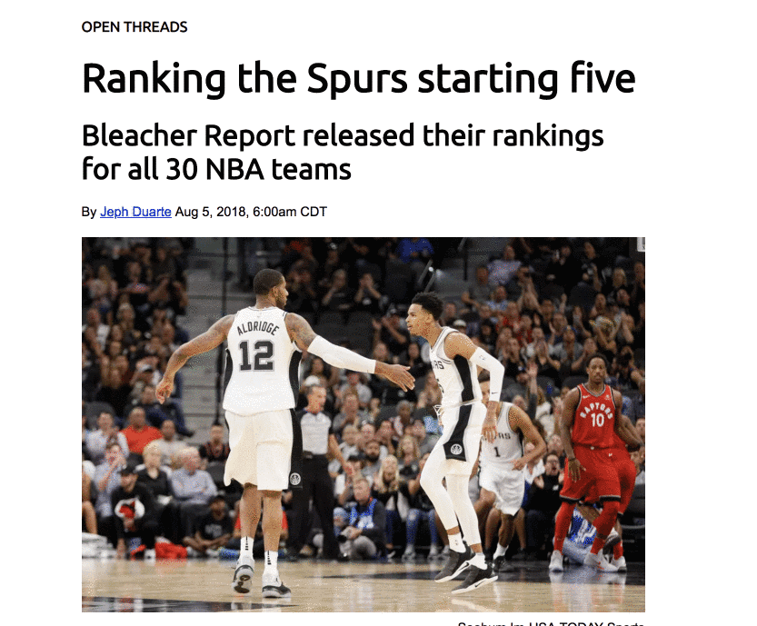

# CSS Homeowork: Build a sports story

For this homework assignment, you will be picking up from the last HTML homework assignment and enhancing it with your own CSS, with the directions provided below. You'll also have to figure out some new things, but that is part of coding.

# Goal

To make a news story, something like this:

## Requirements

- Make sure you update your `homework-story.html` file with any of the feedback provided by your instructor.
- Use a css reset file. You can use the same one we used with the in-class assignment.
- Make the article width 620px.
- Set your base font as "Times New Roman" with acceptable backups.
- Set the base font size for all text items to be the equivalent of 10px, like we did with the in-class recipe.
- Use [Google Fonts](https://fonts.google.com/) to find and use a font called "Ubuntu" and add that to your page. You'll need to figure out how to do that, but it isn't difficult.
- Set all your headlines to use Ubuntu and set headline sizes that make visual sense, but follow convention. (i.e., make sure h1 is the biggest and is used for the article headline.) Make sure you include the label above the headline.
- In the HTML, set the width of the photo to 620px using a "width" attribute.
- Set the byline and photo credit lines to use the font Arial with an appropriate backup. Adjust sizes so they are appealing visually.
- Make the photo credit text right-aligned and nudge up the margin so it sits close but not upon the photo so readers know that is what it goes with.
- For the blockquote, set a solid left border that is grey and 4 px wide. Give it padding on the left of 20px.
- For the ordered list style, the numbers should line up with the text in the article. My recommendation in working this out is to first set different background-colors for the `<ol>` and `<li>` tags so you can see the boundaries. Then you might use a combination of list-style-position and negative margin to line them up.
- Once you are done with everything, push it to Github.
- Turn in the link to your repo.
