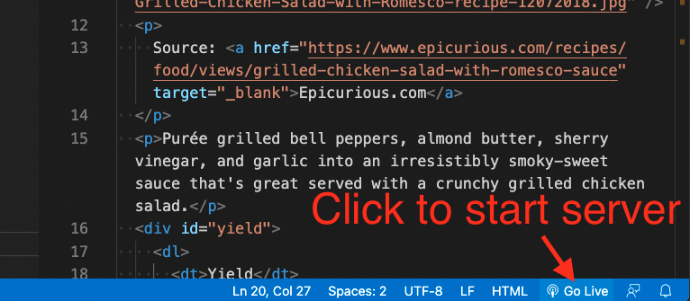

# HTML class assignment

> This lesson has a companion video that walks through the lesson. Find it in Canvas under Panopto Video. It's called **HTML in-class lesson**.

Not every step of this project is explained in detail because you should be using knowledge gained from the Codecademy tutorial. In class (or the Panopto video), I'll show you each step, then you can follow along after it is demonstrated. Along the way, I'll show you some tips and tricks of working in Visual Studio Code.

The goal of this assignment is to:

- Create git repo on your local machine to keep code under source control.
- Create a public Github repo and create a connection to it with your local repo.
- Create a basic web page structure and content.
- Use proper HTML syntax and indenting practices.

While this assignment will be worked on in class, you should have _already_ completed the Codecademy assignments for HTML.

## Our Goal

To meet these objectives, you'll be "coding up" this recipe page with HTML. When this portion is done, it will look like this in your browser:


Since the gif moves all about, here is a [PNG of the rendered HTML](html-done.png).

You also might open and gander at [the recipe page](https://www.epicurious.com/recipes/food/views/grilled-chicken-salad-with-romesco-sauce) this was taken from. (I wouldn't leave that page open as that website is awful and will crash your browser.)

## Resources

You have the internet at your disposal for help. Here are some resources you might find useful.

- You can review steps in the [Codecademy Learn HTML](https://www.codecademy.com/learn/learn-html) course.
- You can look up specific resources in the [W3 Schools HTML](https://www.w3schools.com/html/default.asp) documentation. [Mozilla](https://developer.mozilla.org/en-US/docs/Web/HTML) also has good docs.
- Google it.

## Project setup

This is the same project set up we did in our git/Github intro, but [here are the steps](https://github.com/utdata/icj-class/blob/main/resources/start-a-project.md) if you need a refresher. I also have a [screencast of the complete project setup](https://drive.google.com/file/d/1qdL7BS6wtk14Rise5YO9MTW9FLvyRw-k/view). This is something you should eventually learn to do without having to look it up.

1. Create a project folder and name it `yourname-html-css`.
1. Add a `README.md` and a `.gitignore file`.
1. Create your Github repo and connect it to your local project.

## Build a recipe web page

We're going to build the HTML structure for the recipe page noted above.

1. Create and save a new HTML document called `recipe.html`. You can use the `touch` command to do this.

Next we need the basic elements required for an HTML 5 document. There is a super easy way to do this thanks to a special thing in VS Code called [Emmet](https://code.visualstudio.com/docs/editor/emmet).

1. At the top of the file, type `html` and you'll see some selections come up. Use the arrow key on your keyboard to choose the one `html:5` and hit return. You _should_ get all the boilerplate elements you need for an HTML page.


If all that fails and we can't figure it out, you can go to [W3 School](https://www.w3schools.com/html/html5_intro.asp) and copy/paste the template.

Now to save time, we'll get the unstyled text for our document.

1. Go to the [html-class-text.txt file](https://raw.githubusercontent.com/utdata/icj-class/main/html/html-class-text.txt) in this Github repo and copy/paste the contents in between the `<body>` tag of your document.

Now we'll download the photo we will need.

1. Go to [this page](grilled-chicken-salad-with-romesco-recipe.jpg) in Github.
1. Right-click right in the middle of the photo to get the contextual menu and choose **Save image as**.
1. Save the photo into your project folder, the same as `recipe.html`.


Now to "code up" our text into real HTML:

1. The first line of text is the headline of the article, and that next needs to be in two places:
    - **Copy** the text "Grilled Chicken Salad with Romesco Sauce" and paste it into a `<title>` tag in the head of the document. The `<title>` tag are the words that show on the tab of your browser.
    - Go back to the body of the text and add the open and close `<h1>` tags around that line to make a main headline.
1. Below the `<h1>` tag, add an `` tag with the `src=""` going to the photo you just saved in the same folder. Note that you can just type `img` in your editor and then use some [tab completion](https://code.visualstudio.com/docs/editor/intellisense) to fill out the required elements of the tag.
1. Be sure to also add and ["alt" attribute](https://www.w3schools.com/tags/att_img_alt.asp) to your `img` tag, which allows screen readers (for the blind) to understand what the image is. You might say "recipe photo" for this one.
1. Put a `<p>` tag around the text that starts with "Source".
1. Add an `<a href>` tag around the word `Epicurious.com` and add this url:

`https://www.epicurious.com/recipes/food/views/grilled-chicken-salad-with-romesco-sauce`

1. Add a [target attribute](https://www.w3schools.com/tags/att_a_target.asp) to open the link into a new window. This can come directly after the href url attribute.
1. Put `<p>` tags around the introductory paragraph that starts with "Purée".

### Check your work

**HELPFUL TIP:** You will want to occasionally check to see how your code is displaying in a browser to make sure everything is working as expected. One way is to open the html file in Chrome (File > Open File) and the refresh each time you want to see an update. But there is a better way: When we did computer setup you should've installed a VS Code extension called "Live server". If you click on the "Go Live" button at the bottom-right of VS Code, it will start a web server on your computer and then open the current file in your default browser. As you make changes to the HTML and save it, the page _automagically updates_ in your browser.



### Back to the markup

1. For the section about Yield (about 6 lines), create a `<div>` with an `id` attribute of "yield".
1. Create a [description list](https://www.w3schools.com/html/html_lists_other.asp) for the following set of information, with the text before the colon used as the `<dt>` term and text after the colon as the `<dd>` description.

``` text
Yield: 4 servings
Active Time: 45 minutes
Total Time: 1 hour
```

1. Create a new `<div>` with an `id="ingredients"` that starts before the  "Ingredients" headline, and closes right before "Preparation".
1. Before we build the `<h2>` tag around the "Ingredients" headline, let's learn more about [Emmet](https://docs.emmet.io/) and how it can help us. Emmet is a shorthand syntax and tool for programmers to help write code blocks, and it is [baked into VS Code](https://code.visualstudio.com/docs/editor/emmet). You won't be wowed at this example, but the next one will bring both shock and awe.
1. Highlight the "Ingredient" header. Do **command-shift-p** to bring up the Command Palette. (Control-shift-p for Windows.) Begin typing in the text "Emmet: Wrap" and you'll see the list of commands filter down. Use your arrow keys to select **Emmet: Wrap with Abbreviation** and hit return. That list will go away but the box will remain so you cantype in the next command. Type in the text `h2` and hit return. This will wrap your text in both the beginning and ending `<h2>` tags.

Here is what that more or less looks like:


1. Use the same method to wrap the heading "For the chicken:" with an `<h3>` tag.
1. Now let's really rock some Emmet for the unordered list. Highlight the next five lines from "skinless chicken" to "vegetable oil". Do your **Command-shift-p** for the Command Palette and this time we want a little different command: **Emmet: Wrap Individual Lines with Abbreviation**. Now, type in the text below then hit return:

`ul>li*`

1. All the lines of code should've been wrapped in a `<ul>` and `<li>` tags. Wasn't that bad ass? Here is an [Emmet Cheat Sheet](https://docs.emmet.io/cheat-sheet/) for other commands. We'll use a few more before we're done.
1. Now repeat the process for the `<h3>`'s and unordered lists for the rest of the ingredients section.
1. For the Preparation section, you'll want to wrap the entire section in a `<div>` with an `id` attribute called "preparation".
1. Wrap each internal headline (they end with a colon) in an `<h3>` tag.
1. For each set of steps (except "Do ahead" steps) in the different preparation sections, turn them into ordered lists. Use the **Emmet: Wrap Individual Lines with Abbreviations** again, but change the list style to this:

`ol>li*`

1. On the lines that say "Do ahead", make those paragraphs with `<p>` tags instead of of ordered lists. Add a `<strong>` tag around the label "Do ahead".
1. Code up the Nutrition section in a similar way by putting the whole section in a `<div>` with an `id` of "nutrition", and then set the items as an unordered list.

## Commit and push your code

Save, add, commit and the push your code to your repo in Github. To review, the steps are:

1. Use `git status` to check the status of your files. You probably have two untracked files.
1. Use `git add .` to add all the untracked files files. (If you didn't want all of them, would would specify them: `git add {file/path} {file/path}`.)
1. Use `git commit -m "your message here"` to commit your changes. Write your own message that explains what you have done with this commit.
1. Use `git push origin main` to push them to Github.

## Turn in your work

Turn in a link to your repo in the assignment in canvas.
