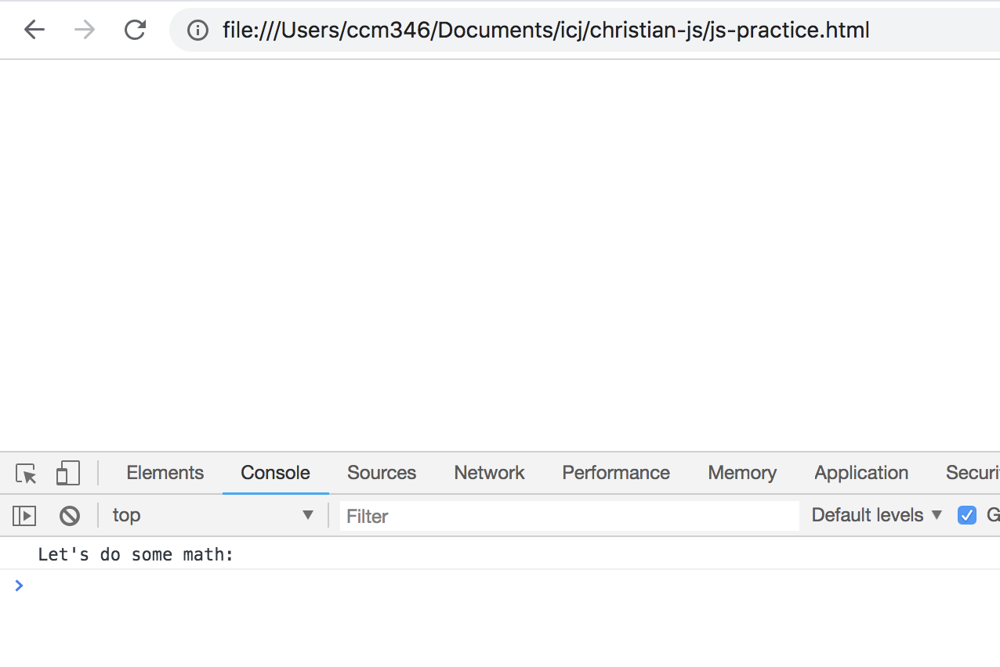

# JavaScript in-class

JavaScript is the programming language of the browser. We're going to practice using JavaScript by manipulating numbers, strings and making functions and seeing the result in our browser Console.

I'll be using Chrome in class, so it might be helpful to do so yourself. Safari, Firefox and Edge do work and have all the tools necessary, but it might be easier to follow along if you use Chrome.

## Get set up

- Set up a new, Github repository (with a README.md file) for today's assignment. Clone it to your local machine inside your `/icj/` folder.
- You'll need to create a new HTML file (call it js-practice.html) with the HTML5 boilerplate, and the [W3's](https://www.w3schools.com/html/html5_intro.asp) file will suffice.

We will be typing all our code between a `<script>` tag on that page. Mark the answers for each question using JavaScript's comment syntax:

```html
<script>

// This is a comment
var somecode = 'this code';

/*
FYI that this is a comment, too
but it can be on more then one line
*/

</script>
```

You'll test all the functions by opening this page with a browser window and then looking at the Inspector's Console window. The Console is one way we can interact with JavaScript in a browser, and vise versa.

Let's get something log some text to the Console so you can see it work. `console` is our

- Between the script tags, on a line by itself:

```js
console.log("Let's do math:");
```

- Save your `js-practice.html` files.
- Open that page in your browser. It's probably blank.
- Open your Inspector. Easiest way in Chome is to Control-click on the blank page and choose Inspector in the contextual menu.
- Click on the Console tab. It should look like this:



Note we use double-quotes to signify our string. Just so you know, we could use single quotes if we are consistent, but then we would've needed to escape the single quote in the text as `Let\'s`.

## Writing to the console

- Use `let` to create a new variable `x` and set it to `5`. Log `x`'s value to the console.

```js
let x = 5;
console.log(x);
```

- Save your html page, then refresh your browser and you should see your console update to include the "5" in the log.

### var vs let vs const

Remember how the Codecademy lesson showed you two ways to declare variables in JavaScript: `let` and `const`? Well, those are actually relatively new ways of declaring variables, introduced in ES6, a version of JavaScript introduced in 2015, but not yet fully implemented in browsers. Before ES6, we used `var` to declare variables. `var` still works and you will see it in just about any JavaScript code written today. , but here are very simplified differences:

- If you declare a variable with `var`, you can re-declare it later and doing so will change its value.
- If you declare a variable with `let`, you can change it's value later, but you can't re-declare it. If you try, you will get an error. This is usually good, because it tells you it was already in use.
- If you declare a variable with `const`, you can't change its value later.

There is lots more to it, mainly dealing with "scope". You can [read more about the differences](https://wesbos.com/javascript-scoping/), but I don't want to get bogged down with it here.

We're going to use `var` for the rest of this lesson.

## Let's do some math in JavaScript

- Use `var` to create a new variable `y` and set it to `3`. Log `y`'s value to the console.

```js
var y = 3;
console.log(y);
```

- Save your file and refresh your browser to make sure it worked.

- Create a new variable `z` and set it to `x` multiplied `y`, using the `x` and `y` variables (don't just use the numbers 3 and 5). Log `z`'s value to the Console.

```js
var z = x * y;
console.log(z);
```

### Math on your own

- Add a JavaScript comment called "Math on my own".
- Repeat that last steps, but use addition (`+`), subtraction (`-`) and division (`/`) using **new** variable names (not `z`) and values. These are three different new things, each logged to the Console.
- Commit your changes to Github.

## Working with strings

- Add a new console log with the text "Working with strings:".
- Create separate variables (call them whatever you want) for your first, middle and last name. Log each of them to the console.

```js
console.log("Working with strings:");

var first = 'Christian';
var middle = 'Clay';
var last = 'McDonald';
```

- Use string concatenation (`+`) to join the variables you just created into a new variable called `name`. Make sure to include spaces between each name part. Log it to the console.

```js
var name = first + " " + middle + " " + last;
console.log(name)
```

OK, we now have created a variable that has your entire name, built from other variables.

### Strings on your own

- Add a JavaScript comment with the text "Strings on my own".
- Join `name` together with the string `'My name is'` into a new variable, `greeting`, so its new value is *my name is YOUR NAME*. Log that new value to the console.
- Commit your changes to Github.
