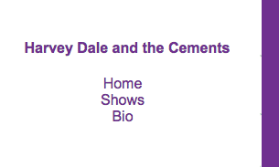

# Refactoring our Sass

If you don't already have your code open in VS Code, go ahead and open it. Run `$ gulp dev` in your terminal to start the development environment.


## CSS is SCSS

Any valid CSS is also valid SCSS. As such, we prep our project to use our new SCSS setup by using what we already have.

- Copy the contents of `src/scss/old-styles.css` and paste it into `src/scss/new-styles.scss`. Once you do, you might see your terminal kick off the sass task to compile the file.
- Now change the css `<link>` tag hrefs in our `src/html/index.html` and `src/html/shows.html` files to point to `css/new-styles.css`. Once you save, you'll again see your browser refresh, but you should not see any difference in the page because our new SCSS is the same as the old, for now.

## Variables

One of the most useful features of Sass is to define variables for certain CSS values. Once you use the variable names in your code, you can then change the definition of the variable in one place, affecting your whole site. This makes it easy to change or support themes throughout your website.

You create variable names with a dollar sign and then define its value like a CSS rule. When you want to use that variable's value, use that variable name as the rule. We set all the variables at the top of the file so they can be found easily.

```scss
// set the variable
$dark-border: 3px solid black;
$light-border: 1px dashed #eee;

// use the variable
.bigbox {
  border: $dark-border;
}

blockquote {
  // using the variable again
  border-left: $dark-border;
  padding-left: 20px;
}
```

Now, if we wanted to change our dark borders from 3px black lines to 5px grey lines, we would do it ONCE when we set the `$dark-border` variable, and it would change throughout the site.

### Variables exercise

There are two colors defined in our styles for our Harvey Dale and the Cements band website. Let's Sassify them.

- Create two new variables at the top of your `src/scss/new-styles.scss` file called `$primary-color` and `$secondary-color` and define their values from what is in the CSS.
- Replace the values where those colors were used with the new variable names.
- Save and check your page. There should be no difference.
- Change your `$primary-color` variable value to a new color, like "red", and see if what happens.

You should see your background color change on _both_ the "home" page and the "shows" page.

If you don't see a change, then make sure that your `gulp dev` task is running in your Terminal so your Sass is getting compiled. If that is working but you still don't see a change, make sure your `index.html` and `shows.html` files are pointing to the correct `new-styles.css` file.

## Nesting

HTML code often has a clearly nested hierarchy. A `nav` element is often a parent to child `li` elements that make up the navigation links on a website.

CSS doesn't have the same hierarchy by default, but it would be useful in some cases. With Sass, we can use a similar visual hierarchy. We do need to be careful not to nest too much, or our CSS will end up over-qualified and bloated. In addition, we don't want to completely mimic our html heirarchy because then small changes in the HTML might break our styles.

Here is an example:

```scss
nav {
  ul {
    margin: 0;
    padding: 0;
    list-style: none;
  }
  li {
    display: inline-block;
  }
}
```

With this code above, we have specified the styles we are applying to the `ul` and `li` tags will only be applied if they are inside a `nav` element. When they get compiled, it will look like this:

```css
nav ul {
  margin: 0;
  padding: 0;
  list-style: none;
}

nav li {
  display: inline-block;
}
```

Written in our first Sassy way, we can immediately understand that the `ul` and `li` rules apply only to the `nav` element. This particular example doesn't save lines of code, but it can.

### Nesting exercise

In our band website and the structure of our HTML, we can see there is `<div class="container">` that is the parent to all of what is contained in the body. There are two other div elements, `<div class="nav">` and `<div class="content">` that are nested inside the container.

Looking at the CSS file, we have class elements for each of those, as well. Let's refactor our SCSS to reflect this nesting so it is more understandable.

If you look through your CSS, you'll see there are two rules dealing with `.nav` class. It is written this way so that the rule applied to the `<h4>` tag would only happen if it is also inside a div classed as `class="nav"`. This is a opportunity to nest the `h4` rule inside the `.nav` rule in your css so it is clear they work together.

- In `new-styles.scss`, nest the selectors and their properties appropriately. Don't forget you'll no longer need the `.nav` part `.nav h4` if that selector is nested.

Look at your page in the browser to make sure everything is still working.

- Back in your HTML file, consider `<div class="content">`. What elements are first descendants of `.content` in the css? In `new-styles.scss`, nest these selectors accordingly.
- Do any of first descendants of `.nav` or `.content` style rules have descendants with properties? In `new-style.scss`, nest li and its properties inside of ul.

Again, make sure nothing is broken on the page display.

Let's pause and recollect. Do you notice any value that repeats itself over and over again inside of .content? If you look closely you will see that `padding-left: 30px` is an attribute of every direct child of .content.

There's a shorthand CSS selector for applying a property to all direct children, `> * {rule;}`. Using this, we can set the padding rule to all the children of .content.

- Add the `> *` selector inside of `.content` and define the padding-left rule.
- Now that you've done this you can remove `padding-left: 30px;` everywhere else.
- In some cases, you no longer even need the style rule because the padding was the only rule.

## Partials

One advantage Sass allows you is to separate your SCSS rules into discrete files to help maintainability. It makes it easier to find the styles you are editing. (CSS would allow you to import multiple files, but each call would increase load time for your page. With Sass, they all get combined into a single file.)

Sass partials filenames should start with an underscore, like `_nav.scss`, so Sass knows it will be imported and so it will not create a new compiled `.css` file.

## Partials practice

- Inside the `/src/scss` folder, create a three new files:
  - `_base.scss`
  - `_nav.scss`
  - `_content.scss`
- We'll leave our variables in `new-styles.scss`, so the can continue to apply to all the other code that follows.
- Go into `new-styles.scss` and copy/cut all the lines for base elements ... i.e. those not in the `.nav` and `.content`. Add those lines to `_base.scss`.
- Go into `new-styles.scss` and copy/cut all the lines for the `.nav` calls.
- Do the same for all the `.content` calls into the `_content.scss` file.
- Lastly, add @import calls into `new-styles.scss` for our partials. These @import calls will connect your partial scss folders with your `new-styles.scss`. Each should be formulated like this:

```scss
@import 'base';
```

Note that you don't need add the underscore or the `.scss` with these import designations, as Sass assumes it already.

Make sure these @imports come _AFTER_ your variables, because this CSS still cascades, and the variables are used by the imports.

## Make new styles

Now to write some new Sassy SCSS to fix a couple of things.

### Text sizes

- Increase the size of all text, including anchor links, to be `1rem`.

### Nav link colors

Add styles that would make the navigation links be the primary color and behave like those in the body, where the underline only shows on hover.



Selecting these are a bit tricky. [link](https://www.w3schools.com/cssref/sel_link.asp), [hover](https://www.w3schools.com/cssref/sel_hover.asp), [visited](https://www.w3schools.com/cssref/sel_visited.asp) are all separate properties and each one needs to be specified individually with a [text-decoration](https://www.w3schools.com/cssref/pr_text_text-decoration.asp) property.

```scss
a:hover {
  text-decoration: underline;
}
```

You'll want to set these styles in the `_nav.scss` file.

- Set both the link and visited values to have the primary color, and the text-decoration to none.
- Set hover color to the primary color, and text-decoration to underline.

### Set bullet style for shows

The list of shows on the `shows.html` is hard to read. Make some changes to make it look better:


- Make the list of shows a bulleted list. (Style of your choice.)
- Make sure the bullets line up vertically with the video on the page

## Publish to Github

Once everything checks out, push your changes to Github.

------

Next: [Publishing to the Internet](sass-04.md)
