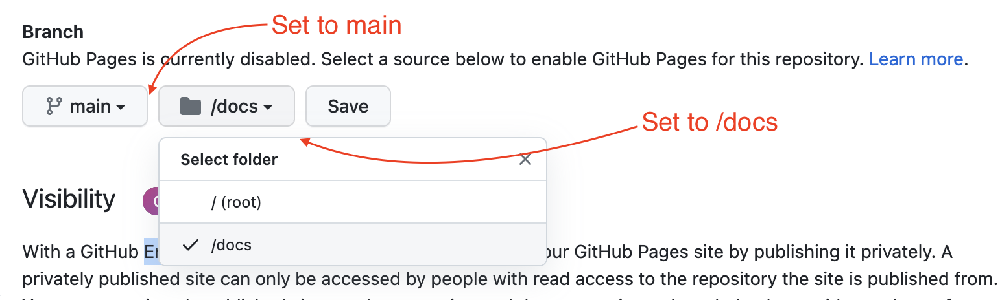

# Publish the /doc folder to the web

Because we put our web site files inside a `docs` folder, we can take advantage of a special feature in Github called [Github Pages](https://pages.github.com/). It will allow us to publish our site to the Internet.

- Go into your Github repo for this project.
- Click on the Settings link.

- Go down to the Github Pages section, and in the **Source** dropdown, choose **Master branch /docs folder**.
- Click **Save**.

Once the page refreshes, it will give you a link to where you can find your site. It works like this:

`https://YOUR-USER-NAME.github.io/YOUR-REPO-NAME/index.html`

It might take a couple of minutes for your site to publish, and if you first view the site and it isn't there, you may have to break your browser cache (hold down command while you refresh the browser) or use a private browser to see your changes. If that doesn't work, make a change to your html, commit and push the changes to Github again.
