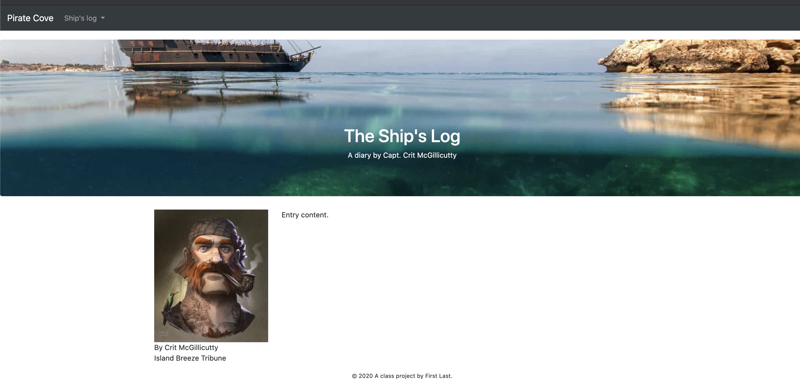

# Detail pages

For our Pirate Cove blog we will have a number of entries that are all the same except for the story content.

## Review the detail layout and pages

Using a "layout" allows us to build a structure for a page once, but then use that structure on as many pages as we like without rewriting the code. Our "Shipping News" page example is just one book among a whole library of pages. Think of this like the Amazon shopping site. Every item you search for has the same basic structure, but the content is different for each item.

Our blogs entries will be similar. We'll have the same page structure: a photo of Capt. McGillicutty in a column on the left, and the blog text in a column on the right.

> The library books example in the project template is a similar detail page, but it uses the "bake" feature to build out pages automatically from data. This "bake" feature is an optional enhancement we'll talk about later. For now, with our Pirate Cove blog, we'll just build our pages manually while still using a "layout" template.

## Building the blog post template

Our goal with building our blog post pages is to use (or extend) the overall site structure from the `base.njk` template, but then to add a new structure for our blog posts inside the "content" block that we can use for each of our blog posts.

### Create an entry layout

In order to understand how this works, we have to create both the "entry" layout and a page that uses it. So bear with me a bit here.

- Create a new file in `src/njk/_layouts` folder with the name `blog.njk`.
- Add this code to the file and save it:

```html



<article class="container">
  <div class="row">
    <div class="col-sm-3">
    <!-- left column -->
    <div class="col-sm-4 left-rail">
      
      <p class="byline">By Crit McGillicutty<br>
      <span>Island Breeze Tribune</span></p>
      <hr class="d-sm-none">
    </div>
    <div class="col-sm-9">
      <!-- right column -->
      Entry content.
    </div>
  </div>
</article>

```

Now we will create a new blog entry page that uses our new layout:

- Create a new file as `src/njk/2019-10-18.njk` and place the following inside it:

```html

```

- Save the file and then go to the page in your web browser. You should be able to use the Ship's Log navigation item to get to the Oct. 18 page.

It should look like this:



Let's chat a bit about this.

Just like our Bootstrap homework, we want Capt. McGillicutty's photo and byline on every blog page, so that is part of the `blog.njk` layout. But in the right-hand column we will want different content for each blog post, so we have a new Nunjucks "block" to reserve the space: `Entry content.`. Right now this block shows the text "Entry content.", but this is just default text. In each of our blog pages, we'll replace that replace that entry block with our blog entry content. Let's do that now.

- Add the following code to your `2019-10-18.njk` file:

```html

<h1>It was a dark and stormy night</h1>
<p>Interloper crimp spanker Barbary Coast splice the main brace bilged on her anchor black spot chandler trysail salmagundi. Brigantine fire ship scallywag log squiffy bowsprit lateen sail American Main cog smartly. Dance the hempen jig bilge log galleon pirate yard list Barbary Coast Corsair run a rig.</p>
<p>Broadside yard bilge rat coxswain ye lugsail dance the hempen jig bilged on her anchor sheet spyglass. Capstan chase guns Privateer maroon haul wind Nelsons folly rum starboard shrouds killick. Weigh anchor quarterdeck ahoy mizzen killick grog driver spike list Nelsons folly.</p>

```

Now look at your block entry page, where you should now have a headline and a couple of paragraphs of text where the blog entry should go.

Let's review what we've done here:

We have built one blog page of many we will have, but we've done so in a way where we can reuse code.

The file `2019-10-18.njk` starts with one line of code, the _extends_ Nunjucks tag that calls our `_layouts/blog.njk` layout that defines the middle of our page. The `blog.njk` layout has two columns, one the left the photo so the Captain's byline will be on every blog, then the column on the right that has a `` tag that will contain that entry's specific text.

 The `blog.njk` layout in turn extends the `_layouts/base.njk` layout that has the navigation, jumbotron and footer, the framework of our site that will be common to every page on the site. That `base.njk` file has a `` tag that gets replaced with our blog entry. (It's [Inception](https://media.giphy.com/media/3GuP496Wrkos8/source.gif).

Sometimes it helps to think of it from the other direction:

This page starts with `_layouts/base.njk` to get the framework of the site with space reserved for the "content" block. Then `_layouts/blog.njk` uses that base layout but replaces "content" with new code. The blog layout has space reserved for the "entry" block. Finally `2019-10-18.njk` uses the blog layout, but replaces that "entry" block with the actual text of our blog entry.

## Create your other detail pages

Now, let's create a pages for our other blog entries.

- Inside the `src/njk` folder, create a new files for: `2019-10-19.njk` and =`2019-10-20.njk`. (Each `filename.njk` file added inside `src/njk/` will become a new HTML page of the same name at `docs/filename.html`.)
- Inside these files, add the same entry code as you did for the first page, but change the headlines to something clever so you can tell them apart when you are viewing them.

Once you save them, you should be able to use the navigation we updated earlier to get to all three pages. If they don't work, make sure you put the pages in the right folder and named them correctly.

Think about this for a second: You added new blog entries to your website with just those few lines of code. Compare this to when you did this with the Bootstrap homework assignment when you had to copy the HTML for the entire page, likely getting them out of sync as you made updates. Now you can change the framework of the site without editing individual pages.

## Update page title and description blocks

Now I want you to update all three blog pages in a similar way:

- Add the following blocks to all three entries. Put it between the extends code and the entry block, but it doesn't really matter.

```html
Page title

Captain's log from 2019-10-XX.
```

- Now in each entry replace the text "Page title" with the text of the headline for that entry. (Don't include the H1.)
- Update the page description block with the correct date for that entry.
- Save all the pages.

If you go to each of the pages you'll see the headline is now in added to title of the browser. Both the `page_title` and `page_description` blocks are in the `_layouts.base.njk` file, and you've replace those blocks those for these pages. (You don't really see the page description displayed anywhere as that is a meta tag in the `<head>` of the page and it is used by Google in search returns to show what the page is about.)

---

NEXT: [Loops and data](static-04-loops.md)
