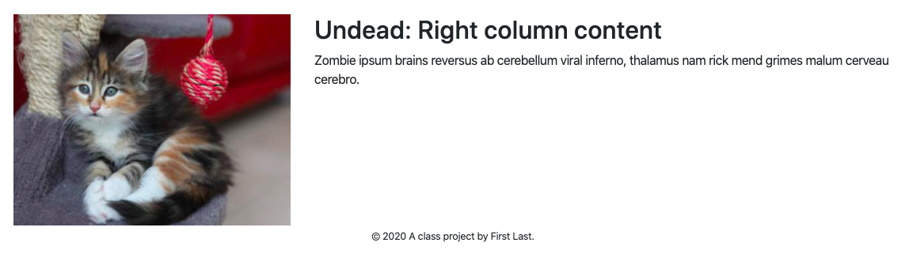
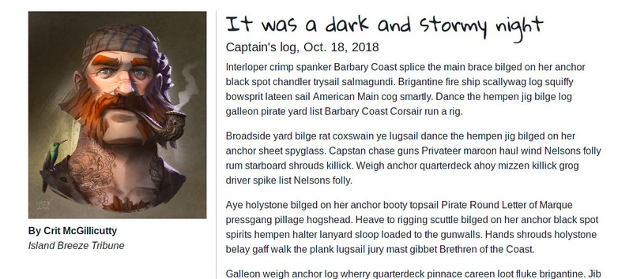
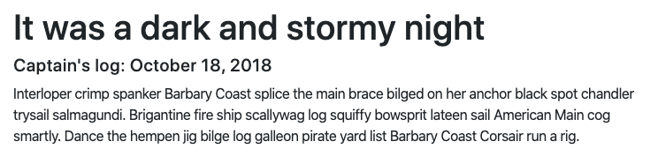

# Detail pages

For our Pirate Cove blog we will have a number of entries that are all the same except for the story content.

Before we look at the code that makes the detail page, let's look at the example in the browser. There is screenshot below or you can click on "link to a book page example" from our index.



This is a detail page made from our detail layouts at `src/njk/_layouts/detail.njk`.

## Review the detail layout and pages

The reason we use a "detail layout" is because we'll have multiple "detail" pages that are all the same except the content. Our "Shipping News" page example would be just one book among a whole library of pages.


>>>> THIS IS WHERE I STOPPED, though there is lots of editing below, too. I need to decide if I'm adding ArchieML to this or waiting for the final.


- Open up the `src/njk/_layouts/detail.njk` file and look at it. This is the content:

```html


{{ book.title }}

{{ book.title }} by {{ book.author }}


<article class="container">
  <div class="row">
    <div class="col-sm-3">
      
        
        <p>{{ book.author }}</p>
      
    </div>
    <div class="col-sm-9">
      
        <h1>{{ book.title }}</h1>
        <p>{{ book.blurb | safe}}</p>
      
    </div>
  </div>
</article>

```

Let's explain these:

- The first line _extends_ the base layout so that all the HTML framework for the entire site is included. We don't have to rewrite or copy that.
- Next we have two _blocks_ for the _page_title_ and _page_description_. Everything between the blocks will be rendered to its reserved space in the base template.
- Next we have the _block content_. This is the guts of out layout, and it is being inserted into the middle of the base template.
- Within our content block we have bootstrap HTML for a two-column layout. And, inside of each column we have new _blocks_ for "info" and "blurb".

But what is all this `{{ book.title }}` and `{{ book.img}}` and stuff?

This layout was built assuming there is data to feed into it. In this case it is looking one instance (or `book`) in the `library.books` array. This is the same data that is in `src/njk/_data/library.json`, but we will tell the page later which row of data we want.

Open the page `src/njk/detail-shipping-news.njk` and you'll see an example of the detail page where it extends the template, then  one other line to set which row of the data we want. In this case the second row, or `library.books[1]` because the counting starts at zero. That's the number in the square brackets ... which row of the data, counting from zero.

## Create an entry layout

- Create a new file in `src/njk/_layouts` with the name `entry.njk`.
- Add this template to the page:

```html


Detail page title

Meta description for detail page.


<article class="container">
  <div class="row">
    <div class="col-sm-3">
    <!-- left column -->
    </div>
    <div class="col-sm-9">
    <!-- right column -->
    </div>
  </div>
</article>


```

## Create our first entry page

- Create a new file as `src/njk/2018-10-18.njk` and place the following inside it:

```html



```

Let's chat a bit about this:

- At the top, we _extend_ the detail layout (which in turn extends the base layout. (It's [Inception](https://media.giphy.com/media/3GuP496Wrkos8/source.gif)).
- Next we have the _block page\_title_ and _block page\_description_ tags so we can udpate those values from the base layout since they are specific to this blog entry.
- Next, we have the _block story_ with some example content.

What you don't see here is _block info_ because that will be the same for every entry. We can fix that in our detail layout.

- Save your page and go look at it in your browser. You should be able to use your navigation link we updated earlier to go to the first page for for Oct. 18th.


## Create your other detail pages

Now, let's create a pages for our other blog entries.

- Inside the `src/njk` folder, create a new files for: `2018-10-19.njk` and =`2018-10-20.njk`. (If you'll recall, this is similar to the file name we used in our navigation except for the extension. Each `filename.njk` file added inside `src/njk/` will become a new HTML page of the same name at `docs/filename.html`.)
- Inside these files, add the same entry code as you did for the first page.

Think about this for a second: You added a new pages to your website with just those few lines of code, compared to when you did this with the Bootstrap Homework assignment, when you had to copy the whole page, likely getting them out of sync. Now you can change the framework of the site without editing individual pages.

## Edit the detail layout

If you remember on our Pirate Cove "blog" pages, we have the same content in the left rail all the time.



As cute as the kitten is, what we need on all the entry pages is the picture of Capt. McGillicutty and his byline, etc. The photo and byline on the left will always be the same. Because of this, we can update the detail-entry layout to use the correct picture and it will update on all three entry pages.

- Open the detail layout `src/njk/_layouts/detail-entry.njk`.
- Replace the code between `` and `` with this:

```html

  
  <p class="byline">By Crit McGillicutty<br>
  <span>Island Breeze Tribune</span></p>

```

This will put the "Crit McGillicutty" byline and photo on every detail entry page, but also allow us to override or add to the block if we needed to.

## Using entries data in the detail page

As you may recall, our `data.json` file has three key values for each entry: date, url and title. We can use that data in this detail page, but we need to tell the page _which_ of the three entries in our data to use. The template can grab the data by its order, but it's weird that it starts counting at `0` instead of at the number 1.

- Open your page `src/njk/2018-10-18.njk`.
- After the _extends_ line, add this:

```html

```

- Now, in your `<h1>` tag, replace the text there with this: `{{ entry.title }}`
- On the next line for the data, replace the text "Oct. XX, 2018" with this: `{{ entry.date }}`
- Save your page and go look at it.

Now your text should look like this:



Update your other two entries in a similar way:

- Add the `set entry` code after the extends line, but change the number to `1` for the 19th and `2` for the 20th.
- Update the _page\_title_ block use use `{{ entry.title}}`.
- Update the _page\_description_ block to say, essentially: "Blog entry for _date_, _title_" but use the proper data tags.

## Check your pages

You should now have a site where the dropdown nav links go to three good story pages and the links from the home page content should also work. Check them now. If they are broken, then compare the filenames used in the navigation with the file names of your pages. The only difference should be `.njk` vs `.html`.

---

NEXT: [Clean up and publishing](static-05-publish.md)
